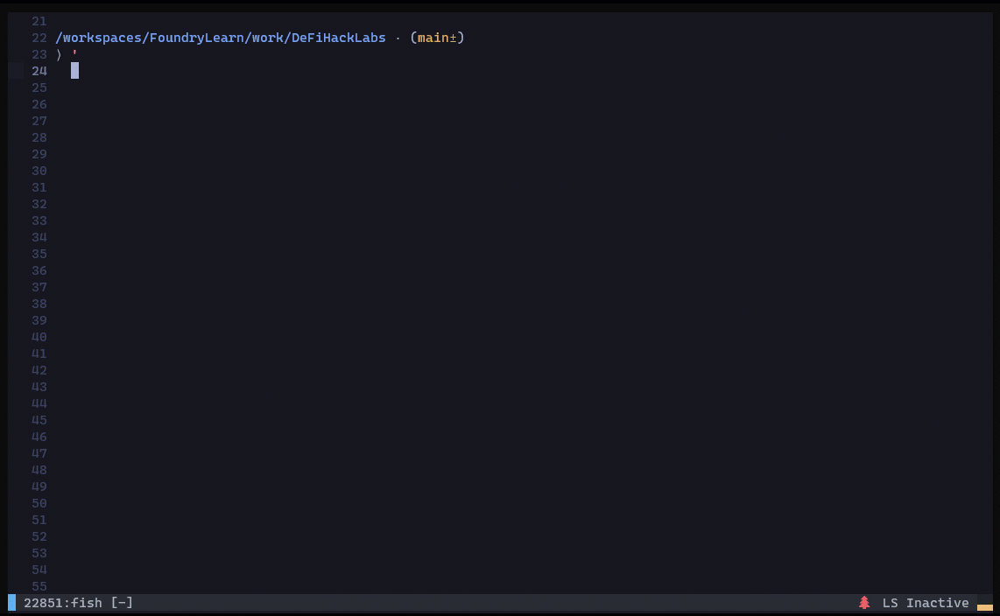

# DeFi Hacks Reproduce - Foundry

**Reproduce DeFi hack incidents using Foundry.**

667 incidents included.

Let's make Web3 secure! Join [Discord](https://discord.gg/Fjyngakf3h)

Notion: [101 root cause analysis of past DeFi hacked incidents](https://web3sec.xrex.io/)

[Transaction debugging tools](https://github.com/SunWeb3Sec/DeFiHackLabs/#transaction-debugging-tools)

**Disclaimer:** This content serves solely as a proof of concept showcasing past DeFi hacking incidents. It is strictly intended for educational purposes and should not be interpreted as encouraging or endorsing any form of illegal activities or actual hacking attempts. The provided information is for informational and learning purposes only, and any actions taken based on this content are solely the responsibility of the individual. The usage of this information should adhere to applicable laws, regulations, and ethical standards.

## Table of Contents
* [Getting Started](#getting-started)
* [Who Support Us](#who-support-us-defihacklabs-received-grant-from)
* [Donate Us](#donate-us)
* [List of Past DeFi Incidents](#list-of-past-defi-incidents)
* [Transaction debugging tools](#transaction-debugging-tools)
* [Ethereum Signature Database](#ethereum-signature-database)
* [Useful tools](#useful-tools)
* [Hacks Dashboard](#hacks-dashboard)
* [List of DeFi Hacks & POCs](#list-of-defi-hacks--pocs)
  
## Getting Started

- Follow the [instructions](https://book.getfoundry.sh/getting-started/installation.html) to install [Foundry](https://github.com/foundry-rs/foundry).

- Clone and install dependencies:`git submodule update --init --recursive`
- [Contributing Guidelines](https://github.com/SunWeb3Sec/DeFiHackLabs/blob/main/CONTRIBUTING.md)

## [Web3 Cybersecurity Academy](https://github.com/SunWeb3Sec/DeFiHackLabs/tree/main/academy)

All articles are also published on [Substack](https://defihacklabs.substack.com/).

### OnChain transaction debugging

- Lesson 1: Tools ( [English](https://github.com/SunWeb3Sec/DeFiHackLabs/tree/main/academy/onchain_debug/01_tools/en) | [中文](https://github.com/SunWeb3Sec/DeFiHackLabs/tree/main/academy/onchain_debug/01_tools) | [Vietnamese](https://github.com/SunWeb3Sec/DeFiHackLabs/tree/main/academy/onchain_debug/01_tools/vi) | [Korean](https://github.com/SunWeb3Sec/DeFiHackLabs/tree/main/academy/onchain_debug/01_tools/ko) | [Spanish](https://github.com/SunWeb3Sec/DeFiHackLabs/tree/main/academy/onchain_debug/01_tools/es) | [日本語](https://github.com/SunWeb3Sec/DeFiHackLabs/tree/main/academy/onchain_debug/01_tools/ja) )
- Lesson 2: Warm up ( [English](https://github.com/SunWeb3Sec/DeFiHackLabs/tree/main/academy/onchain_debug/02_warmup/en/) | [中文](https://github.com/SunWeb3Sec/DeFiHackLabs/tree/main/academy/onchain_debug/02_warmup/) | [Korean](https://github.com/SunWeb3Sec/DeFiHackLabs/tree/main/academy/onchain_debug/02_warmup/ko) | [Spanish](https://github.com/SunWeb3Sec/DeFiHackLabs/tree/main/academy/onchain_debug/02_warmup/es) | [日本語](https://github.com/SunWeb3Sec/DeFiHackLabs/tree/main/academy/onchain_debug/02_warmup/ja) )
- Lesson 3: Write Your Own PoC (Price Oracle Manipulation) ( [English](https://github.com/SunWeb3Sec/DeFiHackLabs/tree/main/academy/onchain_debug/03_write_your_own_poc/en/) | [中文](https://github.com/SunWeb3Sec/DeFiHackLabs/tree/main/academy/onchain_debug/03_write_your_own_poc/) | [Korean](https://github.com/SunWeb3Sec/DeFiHackLabs/tree/main/academy/onchain_debug/03_write_your_own_poc/ko) | [Spanish](https://github.com/SunWeb3Sec/DeFiHackLabs/tree/main/academy/onchain_debug/03_write_your_own_poc/es) | [日本語](https://github.com/SunWeb3Sec/DeFiHackLabs/tree/main/academy/onchain_debug/03_write_your_own_poc/ja) )
- Lesson 4: Write Your Own PoC (MEV Bot) ( [English](https://github.com/SunWeb3Sec/DeFiHackLabs/tree/main/academy/onchain_debug/04_write_your_own_poc/en/) | [中文](https://github.com/SunWeb3Sec/DeFiHackLabs/tree/main/academy/onchain_debug/04_write_your_own_poc/) | [Korean](https://github.com/SunWeb3Sec/DeFiHackLabs/tree/main/academy/onchain_debug/04_write_your_own_poc/kr/) | [Spanish](https://github.com/SunWeb3Sec/DeFiHackLabs/tree/main/academy/onchain_debug/04_write_your_own_poc/es) | [日本語](https://github.com/SunWeb3Sec/DeFiHackLabs/tree/main/academy/onchain_debug/04_write_your_own_poc/ja) )
- Lesson 5: Rugpull Analysis ( [English](https://github.com/SunWeb3Sec/DeFiHackLabs/tree/main/academy/onchain_debug/05_Rugpull/en/) | [中文](https://github.com/SunWeb3Sec/DeFiHackLabs/tree/main/academy/onchain_debug/05_Rugpull/) | [Spanish](https://github.com/SunWeb3Sec/DeFiHackLabs/tree/main/academy/onchain_debug/05_Rugpull/es) | [日本語](https://github.com/SunWeb3Sec/DeFiHackLabs/tree/main/academy/onchain_debug/05_Rugpull/ja)  )
- Lesson 6: Write Your Own PoC (Reentrancy) ( [English](https://github.com/SunWeb3Sec/DeFiHackLabs/tree/main/academy/onchain_debug/06_write_your_own_poc/en/) | [中文](https://github.com/SunWeb3Sec/DeFiHackLabs/tree/main/academy/onchain_debug/06_write_your_own_poc/) | [Spanish](https://github.com/SunWeb3Sec/DeFiHackLabs/tree/main/academy/onchain_debug/06_write_your_own_poc/es) | [日本語](https://github.com/SunWeb3Sec/DeFiHackLabs/tree/main/academy/onchain_debug/06_write_your_own_poc/ja) )
- Lesson 7: Hack Analysis: Nomad Bridge, August 2022 ( [English](https://github.com/SunWeb3Sec/DeFiHackLabs/tree/main/academy/onchain_debug/07_Analysis_nomad_bridge/en/) | [中文](https://github.com/SunWeb3Sec/DeFiHackLabs/tree/main/academy/onchain_debug/07_Analysis_nomad_bridge/) | [Spanish](https://github.com/SunWeb3Sec/DeFiHackLabs/tree/main/academy/onchain_debug/07_Analysis_nomad_bridge/es) | [日本語](https://github.com/SunWeb3Sec/DeFiHackLabs/tree/main/academy/onchain_debug/07_Analysis_nomad_bridge/ja) )

## Who Support Us? DeFiHackLabs Received Grant From

<a href="https://x.com/GCCofCommons">
  
</a>

## Donate us

If you appreciate our work, please consider donating. Even a small amount helps us continue developing and improving our projects, and promoting web3 security.

- Gitcoin - [Donate DeFiHackLabs](https://explorer.gitcoin.co/#/projects/0xbea14fd383c20cd085f30b2baa83ce96be83f1b56464bd74fcc00eb85086e280)
- EVM Chains - 0xD7d6215b4EF4b9B5f40baea48F41047Eb67a11D5
- [Giveth](https://giveth.io/donate/defihacklabs)

## List of Past DeFi Incidents
[20250913 Kame](#20250913-kame---arbitary-external-call)
[20250830 EverValueCoin](#20250830-evervaluecoin---arbitrage)

[20250831 Hexotic](#20250831-hexotic---incorrect-input-validation)

[20250827 0xf340](#20250827-0xf340---access-control)

[20250823 ABCCApp](#20250823-abccapp---lack-of-access-control)

[20250820 MulticallWithXera](#20250820-multicallwithxera---access-control)

[20250820 0x8d2e](#20250820-0x8d2e---access-control)

[20250816 d3xai](#20250816-d3xai---price-manipulation)

[20250815 PDZ](#20250815-pdz---price-manipulation)

[20250815 SizeCredit](#20250815-sizecredit---access-control)

[20250813 YuliAI](#20250813-yuliai---price-manipulation)

[20250813 coinbase](#20250813-coinbase---misconfiguration)

[20250813 Grizzifi](#20250813-grizzifi---logic-flaw)

[20250812 Bebop](#20250812-bebop---arbitrary-user-input)

[20250811 WXC](#20250811-wxc---incorrect-token-burn-mechanism)

[20250728 SuperRare](#20250728-superrare---access-control)

[20250726 MulticallWithETH](#20250726-MulticallWithETH---arbitrary-call)

[20250724 SWAPPStaking](#20250724-swappstaking---incorrect-reward-calculation)

[20250720 Stepp2p](#20250720-stepp2p---logic-flaw)

[20250716 VDS](#20250716-vds---logic-flaw)

[20250709 GMX](#20250709-gmx---share-price-manipulation)

[20250705 Unverified_54cd](#20250705-unverified_54cd---access-control)

[20250705 RANT](#20250705-rant---logic-flaw)

[20250702 FPC](#20250702-fpc---logic-flaw)

[20250629 Stead](#20250629-stead---access-control)

[20250626 ResupplyFi](#20250626-resupplyfi---share-price-manipulation)

[20250625 Unverified_b5cb](#20250625-unverified_b5cb---access-control)

[20250623 GradientMakerPool](#20250623-gradientmakerpool---price-oracle-manipulation)

[20250620 Gangsterfinance](#20250620-gangsterfinance---incorrect-dividends)

[20250619 BankrollStack](#20250619-bankrollstack---incorrect-dividends-calculation)

[20250619 BankrollNetwork](#20250619-bankrollnetwork---incorrect-dividends-calculation)

[20250617 MetaPool](#20250617-metapool---access-control)

[20250612 AAVEBoost](#20250612-AAVEBoost---logic-flaw)

[20250610 unverified_8490](#20250610-Unverified_8490---access-control)

[20250528 Corkprotocol](#20250528-corkprotocol---access-control)

[20250527 UsualMoney](#20250527-usualmoney---arbitrage)

[20250526 YDT](#20250526-YDT---logic-flaw)

[20250524 RICE](#20250524-rice---lack-of-access-control)

[20250520 IRYSAI](#20250520-irysai---rug-pull)

[20250518 KRC](#20250518-krc---deflationary-token)

[20250514 Unwarp](#20250514-unwarp---lack-of-access-control)

[20250511 MBUToken](#20250511-mbutoken---price-manipulation-not-confirmed)

[20250509 Nalakuvara_LotteryTicket50](#20250509-nalakuvara_lotteryticket50---price-manipulation)

[20250426 Lifeprotocol](#20250426-lifeprotocol---price-manipulation)

[20250426 ImpermaxV3](#20250426-impermaxv3---floashloan)

[20250416 Roar](#20250416-roar---rug-pull)

[20250408 Laundromat](#20250408-laundromat---logic-flaw)

[20250404 AIRWA](#20250404-airwa---access-control)

[20250418 BTNFT](#20250418-btnft---claim-rewards-without-protection)

[20250416 YVToken](#20250416-yvtoken---not-slippage-protection)

[20250411 Unverified 0x6077](#20250411-unverified-0x6077---lack-of-access-control)

[20250330 LeverageSIR](#20250330-leveragesir---storage-slot1-collision)

[20250328 Alkimiya_IO](#20250328-alkimiya_io---unsafecast)

[20200327 YziAIToken](#20250327-yziai---rug-pull)

[20250320 BBXToken](#20250320-bbxtoken---price-manipulation)

[20250318 DCFToken](#20250318-dcftoken---lack-of-slippage-protection)

[20250316 wKeyDAO](#20250316-wkeydao---unprotected-function)

[20250314 H2O](#20250314-h2o---weak-random-mint)

[20250311 DUCKVADER](#20250311-duckvader---free-mint-bug)

[20250307 UNI](#20250307-uni--logic-flaw)

[20250307 SBRToken](#20250307-sbr-token---price-manipulation)

[20250305 1inch Fusion V1 Settlement](#20250305-1inch-fusionv1-settlement---arbitrary-yul-calldata)

[20250304 Pump](#20250304-pump---not-slippage-protection)

[20250223 HegicOptions](#20250223-hegicoptions---business-logic-flaw)

[20250222 Unverified_35bc](#20250222-Unverified_35bc---reentrancy)

[20250221 StepHeroNFTs](#20250221-stepheronfts---reentrancy-on-sell-nft)

[20250221 Bybit](#20250221-bybit---phishing-attack)

[20250215 unverified_d4f1](#20250215-unverified_d4f1---access-control)

[20250211 FourMeme](#20250211-fourmeme---logic-flaw)

[20250208 Peapods Finance](#20250208-peapods-finance---price-manipulation)

[20250123 ODOS](#20250123-odos---invalid-signature-verification)

[20250121 Ast](#20250121-ast---price-manipulation)

[20250118 Paribus](#20250118-paribus---bad-oracle)

[20250114 IdolsNFT](#20250114-idolsnft---logic-flaw)

[20250113 Mosca2](#20250113-mosca2---logic-flaw)

[20250112 Unilend](#20250112-unilend---logic-flaw)

[20250111 RoulettePotV2](#20250111-roulettepotv2---price-manipulation)

[20250110 JPulsepot](#20250110-jpulsepot---logic-flaw)

[20250108 HORS](#20250108-hors---access-control)

[20250108 LPMine](#20250108-lpmine---incorrect-reward-calculation)

[20250107 IPC](#20250106-mosca---logic-flaw)

[20250106 Mosca](#20250106-mosca---logic-flaw)

[20250104 SorStaking](#20250104-sorstaking---incorrect-reward-calculation)

[20250104 98#Token](#20250104-98token---unprotected-public-function)

[20250101 LAURAToken](#20250101-lauratoken---pair-balance-manipulation)

<details> <summary> 2024 </summary>

[20241227 Bizness](past/2024/README.md#20241227-bizness---reentrancy)

[20241223 Moonhacker](past/2024/README.md#20241223-moonhacker---improper-input-validation)

[20241218 Slurpy](past/2024/README.md#20241218-slurpycoin---logic-flaw)

[20241216 BTC24H](past/2024/README.md#20241216-btc24h---logic-flaw)

[20241214 JHY](past/2024/README.md#20241214-jhy---logic-flaw)

[20241210 LABUBUToken](past/2024/README.md#20241210-labubu-token---logic-flaw)

[20241210 CloberDEX](past/2024/README.md#20241210-cloberdex---reentrancy)

[20241203 Pledge](past/2024/README.md#20241203-pledge---access-control)

[20241126 NFTG](past/2024/README.md#20241126-NFTG---access-control)

[20241124 Proxy_b7e1](past/2024/README.md#20241124-proxy_b7e1---logic-flaw)

[20241123 Ak1111](past/2024/README.md#20241123-ak1111---access-control)

[20241121 Matez](past/2024/README.md#20241121-matez---integer-truncation)

[20241120 MainnetSettler](past/2024/README.md#20241120-mainnetsettler---access-control)

[20241119 PolterFinance](past/2024/README.md#20241119-polterfinance---flashloan-attack)

[20241117 MFT](past/2024/README.md#20241117-mft---logic-flaw)

[20241114 vETH](past/2024/README.md#20241114-veth---vulnerable-price-dependency)

[20241111 DeltaPrime](past/2024/README.md#20241111-deltaprime---reentrancy)

[20241109 X319](past/2024/README.md#20241109-X319---access-control)

[20241107 ChiSale](past/2024/README.md#20241107-ChiSale---logic-flaw)

[20241107 CoW](past/2024/README.md#20241107-CoW---access-control)

[20241107 UniV2](past/2024/README.md#20241107-UniV2---rug-pull)

[20241105 RPP](past/2024/README.md#20241105-rpp---logic-flaw)

[20241029 BUBAI](past/2024/README.md#20241029-BUBAI---rug-pull)

[20241026 CompoundFork](past/2024/README.md#20241026-compoundfork---flashloan-attack)

[20241022 Erc20transfer](past/2024/README.md#20241022-erc20transfer---access-control)

[20241022 VISTA](past/2024/README.md#20241022-vista---flashmint-receive-error)

[20241013 MorphoBlue](past/2024/README.md#20241013-morphoblue---overpriced-asset-in-oracle)

[20241011 P719Token](past/2024/README.md#20241011-p719token---price-manipulation-inflate-attack)

[20241006 HYDT](past/2024/README.md#20241010-hydt---oracle-price-manipulation)

[20241006 SASHAToken](past/2024/README.md#20241006-sashatoken---price-manipulation)

[20241005 AIZPTToken](past/2024/README.md#20241005-AIZPTToken---wrong-price-calculation)

[20241002 LavaLending](past/2024/README.md#20241002-LavaLending---price-manipulation)

[20241001 FireToken](past/2024/README.md#20241001-firetoken---pair-manipulation-with-transfer-function)

[20240926 OnyxDAO](past/2024/README.md#20240926-OnyxDAO---fake-market)

[20240926 Bedrock_DeFi](past/2024/README.md#20240926-Bedrock_DeFi---swap-eth/btc-1/1-in-mint-function)

[20240924 MARA](past/2024/README.md#20240924-MARA---price-manipulation)

[20240923 PestoToken](past/2024/README.md#20240923-PestoToken---price-manipulation)

[20240923 Bankroll_Network](past/2024/README.md#20240923-Bankroll_Network---incorrect-input-validation)

[20240920 DOGGO](past/2024/README.md#20240920-DOGGO---logic-flaw)

[20240920 Shezmu](past/2024/README.md#20240920-shezmu---access-control)

[20240918 Unverified_766a](past/2024/README.md#20240918-unverified_766a---access-control)

[20240915 WXETA](past/2024/README.md#20240915-WXETA---Logic-Flaw)

[20240913 Unverified_5697](past/2024/README.md#20240913-unverified_5697---access-control)

[20240913 OTSeaStaking](past/2024/README.md#20240913-OTSeaStaking---Logic-Flaw)

[20240912 Unverified_03f9](past/2024/README.md#20240912-Unverified_03f9---access-control)

[20240911 INUMI](past/2024/README.md#20240911-INUMI---access-control)

[20240911 INUMI_db27](past/2024/README.md#20240911-INUMI_db27---access-control)

[20240911 AIRBTC](past/2024/README.md#20240911-AIRBTC---access-control)

[20240910 Caterpillar_Coin_CUT](past/2024/README.md#20240910-Caterpillar_Coin_CUT---price-manipulation)

[20240905 Unverified_a89f](past/2024/README.md#20240905-unverified_a89f---access-control)

[20240905 PLN](past/2024/README.md#20240905-PLN---access-control)

[20240905 HANAToken](past/2024/README.md#20240905-HANAToken---price-manipulation)

[20240904 Unverified_16d0](past/2024/README.md#20240904-unverified_16d0---access-control)

[20240903 Penpiexyz_io](past/2024/README.md#20240903-Penpiexyz_io---reentrancy-and-reward-manipulation)

[20240902 Pythia](past/2024/README.md#20240902-pythia---logic-flaw)

[20240828 Unverified_667d](past/2024/README.md#20240828-unverified_667d---access-control)

[20240828 AAVE](past/2024/README.md#20240828-aave---arbitrary-call-error)

[20240820 COCO](past/2024/README.md#20240820-coco---logic-flaw)

[20240816 Zenterest](past/2024/README.md#20240816-Zenterest---price-out-of-date)

[20240816 OMPxContract](past/2024/README.md#20240816-ompx-contract---flashloan)

[20240814 YodlRouter](past/2024/README.md#20240814-yodlrouter---arbitrary-call)

[20240813 VOW](past/2024/README.md#20240813-vow---misconfiguration)

[20240812 iVest](past/2024/README.md#20240812-iVest---business-logic-flaw)

[20240806 Novax](past/2024/README.md#20240806-Novax---price-manipulation)

[20240801 Convergence](past/2024/README.md#20240801-Convergence---incorrect-input-validation)

[20240724 Spectra_finance](past/2024/README.md#20240724-spectra_finance---incorrect-input-validation)

[20240723 MEVbot_0xdd7c](past/2024/README.md#20240723-mevbot_0xdd7c---incorrect-input-validation)

[20250717 WETC](#20250717-wetc---incorrect-burn-logic)

[20240716 Lifiprotocol](past/2024/README.md#20240716-lifiprotocol---incorrect-input-validation)

[20240714 Minterest](past/2024/README.md#20240714-minterest---Reentrancy)

[20240712 DoughFina](past/2024/README.md#20240712-doughfina---incorrect-input-validation)

[20240711 SBT](past/2024/README.md#20240711-sbt---business-logic-flaw)

[20240711 GAX](past/2024/README.md#20240711-GAX---lack-of-access-control)

[20240708 LW](past/2024/README.md#20240708-Lw---integer-underflow)

[20240705 DeFiPlaza](past/2024/README.md#20240705-defiplaza---loss-of-precision)

[20240703 UnverifiedContr_0x452E25](past/2024/README.md#20240703-UnverifiedContr_0x452E25---lack-of-access-control)

[20240702 MRP](past/2024/README.md#20240702-mrp---reentrancy)

[20240628 Will](past/2024/README.md#20240628-Will---business-logic-flaw)

[20240627 APEMAGA](past/2024/README.md#20240627-APEMAGA---business-logic-flaw)

[20240618 INcufi](past/2024/README.md#20240618-incufi---business-logic-flaw)

[20240617 Dyson_money](past/2024/README.md#20240617-dyson_money---business-logic-flaw)

[20240616 WIFCOIN_ETH](past/2024/README.md#20240616-WIFCOIN_ETH---business-logic-flaw)

[20240611 Crb2](past/2024/README.md#20240616-Crb2---business-logic-flaw)

[20240611 JokInTheBox](past/2024/README.md#20240611-JokInTheBox---business-logic-flaw)

[20240610 UwuLend - Price Manipulation](past/2024/README.md#20240610-UwuLend---Price-Manipulation)

[20240610 Bazaar](past/2024/README.md#20240610-bazaar---insufficient-permission-check)

[20240608 YYStoken](past/2024/README.md#20240608-YYStoken---business-logic-flaw)

[20240606 SteamSwap](past/2024/README.md#20240606-steamswap---logic-flaw)

[20240606 MineSTM](past/2024/README.md#20240606-MineSTM---business-logic-flaw)

[20240604 NCD](past/2024/README.md#20240604-NCD---business-logic-flaw)

[20240601 VeloCore](past/2024/README.md#20240601-VeloCore---lack-of-access-control)

[20240531 Liquiditytokens](past/2024/README.md#20240531-liquiditytokens---business-logic-flaw)

[20240531 MixedSwapRouter](past/2024/README.md#20240531-MixedSwapRouter---arbitrary-call)

[20240529 SCROLL](past/2024/README.md#20240529-SCROLL---integer-underflow)

[20240529 MetaDragon](past/2024/README.md#20240529-metadragon---lack-of-access-control)

[20240528 Tradeonorion](past/2024/README.md#20240528-Tradeonorion---business-logic-flaw)

[20240528 EXcommunity](past/2024/README.md#20240528-EXcommunity---business-logic-flaw)

[20240527 RedKeysCoin](past/2024/README.md#20240527-redkeyscoin---weak-rng)

[20240526 NORMIE](past/2024/README.md#20240526-normie---business-logic-flaw)

[20240522 Burner](past/2024/README.md#20240522-Burner---sandwich-ack)

[20240516 TCH](past/2024/README.md#20240516-tch---signature-malleability-vulnerability)

[20240514 Sonne Finance](past/2024/README.md#20240514-sonne-finance---precision-loss)

[20240514 PredyFinance](past/2024/README.md#20240514-predyfinance---reentrancy)

[20240512 TGC](past/2024/README.md#20240512-tgc---business-logic-flaw)

[20240510 GFOX](past/2024/README.md#20240510-gfox---lack-of-access-control)

[20240510 TSURU](past/2024/README.md#20240510-tsuru---insufficient-validation)

[20240508 GPU](past/2024/README.md#20240508-GPU---self-transfer)

[20240507 SATURN](past/2024/README.md#20240507-saturn---price-manipulation)

[20240506 OSN](past/2024/README.md#20240506-osn---reward-distribution-problem)

[20240430 Yield](past/2024/README.md#20240430-yield---business-logic-flaw)

[20240430 PikeFinance](past/2024/README.md#20240430-pikefinance---uninitialized-proxy)

[20240427 BNBX](past/2024/README.md#20240427-BNBX---precision-loss)

[20240425 NGFS](past/2024/README.md#20240425-ngfs---bad-access-control)

[20240424 XBridge](past/2024/README.md#20240424-xbridge---logic-flaw)

[20240424 YIEDL](past/2024/README.md#20240424-yiedl---input-validation)

[20240422 Z123](past/2024/README.md#20240422-z123---price-manipulation)

[20240420 Rico](past/2024/README.md#20240420-rico---arbitrary-call)

[20240419 HedgeyFinance](past/2024/README.md#20240419-hedgeyfinance---logic-flaw)

[20240417 UnverifiedContr_0x00C409](past/2024/README.md#20240417-UnverifiedContr_0x00C409---unverified-external-call)

[20240416 SATX](past/2024/README.md#20240416-satx---logic-flaw)

[20240416 MARS_DEFI](past/2024/README.md#20240416-mars---bad-reflection)

[20240415 GFA](past/2024/README.md#20240415-gfa---business-logic-flaw)

[20240415 ChaingeFinance](past/2024/README.md#20240415-chaingeFinance---arbitrary-external-call)

[20240414 Hackathon](past/2024/README.md#20240414-hackathon---business-logic-flaw)

[20240412 FIL314](past/2024/README.md#20240412-fil314---insufficient-validation-and-price-manipulation)

[20240412 SumerMoney](past/2024/README.md#20240412-sumermoney---Reentrancy)

[20240412 GROKD](past/2024/README.md#20240412-grokd---lack-of-access-control)

[20240410 BigBangSwap](past/2024/README.md#20240410-BigBangSwap---precision-loss)

[20240409 UPS](past/2024/README.md#20240409-ups---business-logic-flaw)

[20240408 SQUID](past/2024/README.md#20240408-squid---sandwich-attack)

[20240404 WSM](past/2024/README.md#20240404-wsm---manipulating-price)

[20240402 HoppyFrogERC](past/2024/README.md#20240402-hoppyfrogerc---business-logic-flaw)

[20240401 ATM](past/2024/README.md#20240401-atm---business-logic-flaw)

[20240401 OpenLeverage](past/2024/README.md#20240401-openleverage---business-logic-flaw)

[20240329 ETHFIN](past/2024/README.md#20240329-ethfin---lack-of-access-control)

[20240329 PrismaFi](past/2024/README.md#20240329-prismaFi---insufficient-validation)

[20240328 LavaLending](past/2024/README.md#20240328-lavalending---business-logic-flaw)

[20240325 ZongZi](past/2024/README.md#20240325-zongzi---price-manipulation)

[20240314 ARK](past/2024/README.md#20240324-ark---business-logic-flaw)

[20240323 CGT](past/2024/README.md#20240323-cgt---incorrect-access-control)

[20240321 SSS](past/2024/README.md#20240321-sss---token-balance-doubles-on-transfer-to-self)

[20240320 Paraswap](past/2024/README.md#20240320-paraswap---incorrect-access-control)

[20240314 MO](past/2024/README.md#20240314-mo---business-logic-flaw)

[20240313 IT](past/2024/README.md#20240313-it---business-logic-flaw)

[20240312 BBT](past/2024/README.md#20240312-bbt---business-logic-flaw)

[20240311 Binemon](past/2024/README.md#20240311-Binemon---precission-loss)

[20240309 Juice](past/2024/README.md#20240309-juice---business-logic-flaw)

[20240309 UnizenIO](past/2024/README.md#20240309-unizenio---unverified-external-call)

[20240307 GHT](past/2024/README.md#20240307-ght---business-logic-flaw)

[20240306 ALP](past/2024/README.md#20240306-alp---public-internal-function)

[20240306 TGBS](past/2024/README.md#20240306-tgbs---business-logic-flaw)

[20240305 Woofi](past/2024/README.md#20240305-woofi---price-manipulation)

[20240228 Seneca](past/2024/README.md#20240228-seneca---arbitrary-external-call-vulnerability)

[20240228 SMOOFSStaking](past/2024/README.md#20240228-smoofsstaking---reentrancy)

[20240223 Zoomer](past/2024/README.md#20240223-zoomer---business-logic-flaw)

[20240223 CompoundUni](past/2024/README.md#20240223-CompoundUni---Oracle-bad-price)

[20240223 BlueberryProtocol](past/2024/README.md#20240223-BlueberryProtocol---logic-flaw)

[20240222 SwarmMarkets](past/2024/README.md#20240222-SwarmMarkets---lack-of-validation)

[20240221 DeezNutz404](past/2024/README.md#20240221-deeznutz-404---lack-of-validation)

[20240221 GAIN](past/2024/README.md#20240221-GAIN---bad-function-implementation)

[20240220 EGGX](past/2024/README.md#20240220-EGGX---reentrancy)

[20240219 RuggedArt](past/2024/README.md#20240219-RuggedArt---reentrancy)

[20240216 ParticleTrade](past/2024/README.md#20240216-ParticleTrade---lack-of-validation-data)

[20240215 DualPools](past/2024/README.md#20240215-DualPools---precision-truncation)

[20240215 Babyloogn](past/2024/README.md#20240215-Babyloogn---lack-of-validation)

[20240215 Miner](past/2024/README.md#20240215-Miner---lack-of-validation-dst-address)

[20240213 MINER BSC](past/2024/README.md#20240213-miner---price-manipulation)

[20240211 Game](past/2024/README.md#20240211-game---reentrancy--business-logic-flaw)

[20240210 FILX DN404](past/2024/README.md#20240210-filx-dn404---access-control)

[20240208 Pandora404](past/2024/README.md#20240208-pandora---interger-underflow)

[20240205 BurnsDefi](past/2024/README.md#20240205-burnsdefi---price-manipulation)

[20240202 ADC](past/2024/README.md#20240202-adc---incorrect-access-control)

[20240201 AffineDeFi](past/2024/README.md#20240201-affinedefi---lack-of-validation-userData)

[20240130 XSIJ](past/2024/README.md#20240130-xsij---business-logic-flaw)

[20240130 MIMSpell](past/2024/README.md#20240130-mimspell---precission-loss)

[20240129 PeapodsFinance](past/2024/README.md#20240128-PeapodsFinance---reentrancy)

[20240128 BarleyFinance](past/2024/README.md#20240128-barleyfinance---reentrancy)

[20240127 CitadelFinance](past/2024/README.md#20240127-citadelfinance---price-manipulation)

[20240125 NBLGAME](past/2024/README.md#20240125-nblgame---reentrancy)

[20240122 DAO_SoulMate](past/2024/README.md#20240122-dao_soulmate---incorrect-access-control)

[20240117 BmiZapper](past/2024/README.md#20240117-bmizapper---arbitrary-external-call-vulnerability)

[20240117 SocketGateway](past/2024/README.md#20240112-socketgateway---lack-of-calldata-validation)

[20240115 Shell_MEV_0xa898](past/2024/README.md#20240115-Shell_MEV_0xa898---lack-of-access-control)

[20240112 WiseLending](past/2024/README.md#20240112-wiselending---bad-healthfactor-check)

[20240110 Freedom](past/2024/README.md#20240110-Freedom---lack-of-access-control)

[20240110 LQDX Alert](past/2024/README.md#20240110-lqdx---unauthorized-transferfrom)

[20240104 Gamma](past/2024/README.md#20240104-gamma---price-manipulation)

[20240102 MIC](past/2024/README.md#20240102-mic---business-logic-flaw)

[20240102 RadiantCapital](past/2024/README.md#20240102-radiantcapital---loss-of-precision)

[20240101 OrbitChain](past/2024/README.md#20240101-orbitchain---incorrect-input-validation)

</details>

<details> <summary> 2023 </summary>

[20231231 Channels BUSD&USDC](past/2023/README.md#20231231-channels---price-manipulation)

[20231230 ChannelsFinance](past/2023/README.md#20231230-channelsfinance---compoundv2-inflation-attack)

[20231228 CCV](past/2023/README.md#20231225-CCV---precision-loss)

[20231228 DominoTT](past/2023/README.md#20231228-dominott---precision-loss) 

[20231225 Telcoin](past/2023/README.md#20231225-telcoin---storage-collision)

[20231222 PineProtocol](past/2023/README.md#20231222-pineprotocol---business-logic-flaw)

[20231220 TransitFinance](past/2023/README.md#20231220-transitfinance---lack-of-validation-pool)

[20231217 Bob](past/2023/README.md#20231217-bob---price-manipulation)

[20231217 FloorProtocol](past/2023/README.md#20231217-floorprotocol---business-logic-flaw)

[20231216 GoodDollar](past/2023/README.md#20231216-gooddollar---lack-of-input-validation--reentrancy)

[20231216 KEST](past/2023/README.md#20231216-kest---business-logic-flaw)

[20231216 NFTTrader](past/2023/README.md#20231216-nfttrader---reentrancy)

[20231214 PHIL](past/2023/README.md#20231214-PHIL---business-logic-flaw)

[20231213 HYPR](past/2023/README.md#20231213-hypr---business-logic-flaw)

[20231211 GoodCompound](past/2023/README.md#20231211-goodcompound---price-manipulation)

[20231209 BCT](past/2023/README.md#20231209-bct---price-manipulation)

[20231207 HNet](past/2023/README.md#20231207-HNet---business-logic-flaw)

[20231206 TIME](past/2023/README.md#20231206-time---arbitrary-address-spoofing-attack)

[20231206 ElephantStatus](past/2023/README.md#20231206-elephantstatus---price-manipulation)

[20231205 MAMO](past/2023/README.md#20231205-mamo---price-manipulation)

[20231205 BEARNDAO](past/2023/README.md#20231205-bearndao---business-logic-flaw)

[20231202 bZxProtocol](past/2023/README.md#20231202-bzxprotocol---inflation-attack)

[20231201 UnverifiedContr_0x431abb](past/2023/README.md#20231201-unverifiedcontr_0x431abb---business-logic-flaw)

[20231130 EEE](past/2023/README.md#20231130-eee---price-manipulation)

[20231130 CAROLProtocol](past/2023/README.md#20231130-carolprotocol---price-manipulation-via-reentrancy)

[20231129 Burntbubba](past/2023/README.md#20231129-burntbubba---price-manipulation)

[20231129 AIS](past/2023/README.md#20231129-ais---access-control)

[20231128 FiberRouter](past/2023/README.md#20231128-FiberRouter---input-validation)

[20231125 MetaLend](past/2023/README.md#20231125-metalend---compoundv2-inflation-attack)

[20231125 TheNFTV2](past/2023/README.md#20231125-thenftv2---logic-flaw)

[20231122 KyberSwap](past/2023/README.md#20231122-kyberswap---precision-loss)

[20231117 Token8633_9419](past/2023/README.md#20231117-token8633_9419---price-manipulation)

[20231117 ShibaToken](past/2023/README.md#20231117-shibatoken---business-logic-flaw)

[20231116 WECO](past/2023/README.md#20231116-weco---business-logic-flaw)

[20231115 EHX](past/2023/README.md#20231115-ehx---lack-of-slippage-control)

[20231115 XAI](past/2023/README.md#20231115-xai---business-logic-flaw)

[20231115 LinkDAO](past/2023/README.md#20231115-linkdao---bad-k-value-verification)

[20231114 OKC Project](past/2023/README.md#20231114-OKC-Project---Instant-Rewards-Unlocked)

[20231112 MEV_0x8c2d](past/2023/README.md#20231112-mevbot_0x8c2d---lack-of-access-control)

[20231112 MEV_0xa247](past/2023/README.md#20231112-mevbot_0xa247---incorrect-access-control)

[20231111 Mahalend](past/2023/README.md#20231111-mahalend---donate-inflation-exchangerate--rounding-error)

[20231110 Raft_fi](past/2023/README.md#20231110-raft_fi---donate-inflation-exchangerate--rounding-error)

[20231110 GrokToken](past/2023/README.md#20231110-grok---lack-of-slippage-protection)

[20231107 RBalancer](past/2023/README.md#20231107-rbalancer---business-logic-flaw)

[20231107 MEVbot](past/2023/README.md#20231107-mevbot---lack-of-access-control)

[20231106 TrustPad](past/2023/README.md#20231106-trustpad---lack-of-msgsender-address-verification)

[20231106 TheStandard_io](past/2023/README.md#20231106-thestandard_io---lack-of-slippage-protection)

[20231106 KR](past/2023/README.md#20231106-KR---precission-loss)

[20231102 BRAND](past/2023/README.md#20231102-brand---lack-of-access-control)

[20231102 3913Token](past/2023/README.md#20231102-3913token---deflationary-token-attack)

[20231101 SwampFinance](past/2023/README.md#20231101-swampfinance---business-logic-flaw)

[20231101 OnyxProtocol](past/2023/README.md#20231101-onyxprotocol---precission-loss-vulnerability)

[20231031 UniBotRouter](past/2023/README.md#20231031-UniBotRouter---arbitrary-external-call)

[20231030 LaEeb](past/2023/README.md#20231030-laeeb---lack-slippage-protection)

[20231028 AstridProtocol](past/2023/README.md#20231028-AstridProtocol---business-logic-flaw)

[20231024 MaestroRouter2](past/2023/README.md#20231024-maestrorouter2---arbitrary-external-call)

[20231022 OpenLeverage](past/2023/README.md#20231022-openleverage---business-logic-flaw)

[20231019 kTAF](past/2023/README.md#20231019-ktaf---compoundv2-inflation-attack)

[20231018 HopeLend](past/2023/README.md#20231018-hopelend---div-precision-loss)

[20231018 MicDao](past/2023/README.md#20231018-micdao---price-manipulation)

[20231013 BelugaDex](past/2023/README.md#20231013-belugadex---price-manipulation)

[20231013 WiseLending](past/2023/README.md#20231013-wiselending---donate-inflation-exchangerate--rounding-error)

[20231012 Platypus](past/2023/README.md#20231012-platypus---business-logic-flaw)

[20231011 BH](past/2023/README.md#20231011-bh---price-manipulation)

[20231008 ZS](past/2023/README.md#20231008-zs---business-logic-flaw)

[20231008 pSeudoEth](past/2023/README.md#20231008-pseudoeth---pool-manipulation)

[20231007 StarsArena](past/2023/README.md#20231007-starsarena---reentrancy)

[20231005 DePayRouter](past/2023/README.md#20231005-depayrouter---business-logic-flaw)

[20230930 FireBirdPair](past/2023/README.md#20230930-FireBirdPair---lack-slippage-protection)

[20230929 DEXRouter](past/2023/README.md#20230929-dexrouter---arbitrary-external-call)

[20230926 XSDWETHpool](past/2023/README.md#20230926-XSDWETHpool---reentrancy)

[20230924 KubSplit](past/2023/README.md#20230924-kubsplit---pool-manipulation)

[20230921 CEXISWAP](past/2023/README.md#20230921-cexiswap---incorrect-access-control)

[20230916 uniclyNFT](past/2023/README.md#20230916-uniclynft---reentrancy)

[20230911 0x0DEX](past/2023/README.md#20230911-0x0dex---parameter-manipulation)

[20230909 BFCToken](past/2023/README.md#20230909-bfctoken---business-logic-flaw)

[20230908 APIG](past/2023/README.md#20230908-apig---business-logic-flaw)

[20230907 HCT](past/2023/README.md#20230907-hct---price-manipulation)

[20230905 QuantumWN](past/2023/README.md#20230905-quantumwn---rebasing-logic-issue)

[20230905 JumpFarm](past/2023/README.md#20230905-JumpFarm---rebasing-logic-issue)

[20230905 HeavensGate](past/2023/README.md#20230905-HeavensGate---rebasing-logic-issue)

[20230905 FloorDAO](past/2023/README.md#20230905-floordao---rebasing-logic-issue)

[20230902 DAppSocial](past/2023/README.md#20230902-dappsocial---business-logic-flaw)

[20230829 EAC](past/2023/README.md#20230829-eac---price-manipulation)

[20230827 Balancer](past/2023/README.md#20230827-balancer---rounding-error--business-logic-flaw)

[20230826 SVT](past/2023/README.md#20230826-svt---flawed-price-calculation)

[20230824 GSS](past/2023/README.md#20230824-gss---skim-token-balance)

[20230821 EHIVE](past/2023/README.md#20230821-ehive---business-logic-flaw)

[20230819 BTC20](past/2023/README.md#20230819-btc20---price-manipulation)

[20230818 ExactlyProtocol](past/2023/README.md#20230818-exactlyprotocol---insufficient-validation)

[20230814 ZunamiProtocol](past/2023/README.md#20230814-zunamiprotocol---price-manipulation)

[20230809 EarningFram](past/2023/README.md#20230809-earningfram---reentrancy)

[20230802 CurveBurner](past/2023/README.md#20230802-curveburner---lack-slippage-protection)

[20230802 Uwerx](past/2023/README.md#20230802-uwerx---fault-logic)

[20230801 NeutraFinance](past/2023/README.md#20230801-neutrafinance---price-manipulation)

[20230801 LeetSwap](past/2023/README.md#20230801-leetswap---access-control)

[20230731 GYMNET](past/2023/README.md#20230731-gymnet---insufficient-validation)

[20230730 Curve](past/2023/README.md#20230730-curve---vyper-compiler-bug--reentrancy)

[20230726 Carson](past/2023/README.md#20230726-carson---price-manipulation)

[20230724 Palmswap](past/2023/README.md#20230724-palmswap---business-logic-flaw)

[20230723 MintoFinance](past/2023/README.md#20230723-mintofinance---signature-replay)

[20230722 ConicFinance02](past/2023/README.md#20230722-conic-finance-02---price-manipulation)

[20230721 ConicFinance](past/2023/README.md#20230721-conic-finance---read-only-reentrancy--misconfiguration)

[20230721 SUT](past/2023/README.md#20230721-sut---business-logic-flaw)

[20230720 Utopia](past/2023/README.md#20230720-utopia---business-logic-flaw)

[20230720 FFIST](past/2023/README.md#20230720-ffist---business-logic-flaw)

[20230718 APEDAO](past/2023/README.md#20230718-apedao---business-logic-flaw)

[20230718 BNO](past/2023/README.md#20230718-bno---invalid-emergency-withdraw-mechanism)

[20230717 NewFi](past/2023/README.md#20230717-newfi---lack-slippage-protection)

[20230715 USDTStakingContract28](past/2023/README.md#20230715-usdtstakingcontract28---lack-of-access-control)

[20230712 Platypus](past/2023/README.md#20230712-platypus---bussiness-logic-flaw)

[20230712 WGPT](past/2023/README.md#20230712-wgpt---business-logic-flaw)

[20230711 RodeoFinance](past/2023/README.md#20230711-rodeofinance---twap-oracle-manipulation)

[20230711 Libertify](past/2023/README.md#20230711-libertify---reentrancy)

[20230710 ArcadiaFi](past/2023/README.md#20230710-arcadiafi---reentrancy)

[20230708 CIVNFT](past/2023/README.md#20230708-civnft---lack-of-access-control)

[20230708 Civfund](past/2023/README.md#20230708-civfund---lack-of-access-control)

[20230707 LUSD](past/2023/README.md#20230707-LUSD---price-manipulation-attack)

[20230704 BambooIA](past/2023/README.md#20230704-bambooia---price-manipulation-attack)

[20230704 BaoCommunity](past/2023/README.md#20230704-baocommunity---donate-inflation-exchangerate--rounding-error)

[20230703 AzukiDAO](past/2023/README.md#20230703-azukidao---invalid-signature-verification)

[20230630 Biswap](past/2023/README.md#20230630-biswap---v3migrator-exploit)

[20230630 MyAi](past/2023/README.md#20230630-MyAi---business-loigc)

[20230628 Themis](past/2023/README.md#20230628-themis---manipulation-of-prices-using-flashloan)

[20230627 UnverifiedContr_9ad32](past/2023/README.md#20230627-unverifiedcontr_9ad32---business-loigc-flaw)

[20230627 STRAC](past/2023/README.md#20230627-STRAC---business-loigc)

[20230623 SHIDO](past/2023/README.md#20230623-shido---business-loigc)

[20230621 BabyDogeCoin02](past/2023/README.md#20230621-babydogecoin02---lack-slippage-protection)

[20230621 BUNN](past/2023/README.md#20230621-bunn---reflection-tokens)

[20230620 MIM](past/2023/README.md#20230620-mimspell---arbitrary-external-call-vulnerability)

[20230619 Contract_0x7657](past/2023/README.md#20230620-Contract_0x7657---business-loigc)

[20230618 ARA](past/2023/README.md#20230618-ara---incorrect-handling-of-permissions)

[20230617 MidasCapitalXYZ](past/2023/README.md#20230617-midascapitalxyz---precision-loss)

[20230617 Pawnfi](past/2023/README.md#20230617-pawnfi---business-logic-flaw)

[20230615 CFC](past/2023/README.md#20230615-cfc---uniswap-skim-token-balance-attack)

[20230615 DEPUSDT_LEVUSDC](past/2023/README.md#20230615-depusdt_levusdc---incorrect-access-control)

[20230612 Sturdy Finance](past/2023/README.md#20230612-sturdy-finance---read-only-reentrancy)

[20230611 SellToken04](past/2023/README.md#20230611-sellToken04---Price-Manipulation)

[20230607 CompounderFinance](past/2023/README.md#20230607-compounderfinance---manipulation-of-funds-through-fluctuations-in-the-amount-of-exchangeable-assets)

[20230606 VINU](past/2023/README.md#20230606-vinu---price-manipulation)

[20230606 UN](past/2023/README.md#20230606-un---price-manipulation)

[20230602 NST SimpleSwap](past/2023/README.md#20230602-nst-simple-swap---unverified-contract-wrong-approval)

[20230601 DDCoin](past/2023/README.md#20230601-ddcoin---flashloan-attack-and-smart-contract-vulnerability)

[20230601 Cellframenet](past/2023/README.md#20230601-cellframenet---calculation-issues-during-liquidity-migration)

[20230531 ERC20TokenBank](past/2023/README.md#20230531-erc20tokenbank---price-manipulation)

[20230529 Jimbo](past/2023/README.md#20230529-jimbo---protocol-specific-price-manipulation)

[20230529 BabyDogeCoin](past/2023/README.md#20230529-babydogecoin---lack-slippage-protection)

[20230529 FAPEN](past/2023/README.md#20230529-fapen---wrong-balance-check)

[20230529 NOON_NO](past/2023/README.md#20230529-noon-no---wrong-visibility-in-function)

[20230525 GPT](past/2023/README.md#20230525-gpt-token---fee-machenism-exploitation)

[20230524 LocalTrade](past/2023/README.md#20230524-local-trade-lct---improper-access-control-of-close-source-contract)

[20230524 CS](past/2023/README.md#20230524-cs-token---outdated-global-variable)

[20230523 LFI](past/2023/README.md#20230523-lfi-token---business-logic-flaw)

[20230514 landNFT](past/2023/README.md#20230514-landNFT---lack-of-permission-control)

[20230514 SellToken03](past/2023/README.md#20230514-selltoken03---unchecked-user-input)

[20230513 Bitpaidio](past/2023/README.md#20230513-bitpaidio---business-logic-flaw)

[20230513 SellToken02](past/2023/README.md#20230513-selltoken02---price-manipulation)

[20230512 LW](past/2023/README.md#20230512-lw---flashloan-price-manipulation)

[20230511 SellToken01](past/2023/README.md#20230511-selltoken01---business-logic-flaw)

[20230510 SNK](past/2023/README.md#20230510-snk---reward-calculation-error)

[20230509 MCC](past/2023/README.md#20230509-mcc---reflection-token)

[20230509 HODL](past/2023/README.md#20230509-hodl---reflection-token)

[20230506 Melo](past/2023/README.md#20230506-melo---access-control)

[20230505 DEI](past/2023/README.md#20230505-dei---wrong-implemention)

[20230503 NeverFall](past/2023/README.md#20230503-NeverFall---price-manipulation)

[20230502 Level](past/2023/README.md#20230502-level---business-logic-flaw)

[20230428 0vix](past/2023/README.md#20230428-0vix---flashloan-price-manipulation)

[20230427 SiloFinance](past/2023/README.md#20230427-Silo-finance---Business-Logic-Flaw)

[20230424 Axioma](past/2023/README.md#20230424-Axioma---business-logic-flaw)

[20230419 OLIFE](past/2023/README.md#20230419-OLIFE---Reflection-token)

[20230416 Swapos V2](past/2023/README.md#20230416-swapos-v2---error-k-value-attack)

[20230415 HundredFinance](past/2023/README.md#20230415-hundredfinance---donate-inflation-exchangerate--rounding-error)

[20230413 yearnFinance](past/2023/README.md#20230413-yearnFinance---misconfiguration)

[20230412 MetaPoint](past/2023/README.md#20230412-metapoint---Unrestricted-Approval)

[20230411 Paribus](past/2023/README.md#20230411-paribus---reentrancy)

[20230409 SushiSwap](past/2023/README.md#20230409-SushiSwap---Unchecked-User-Input)

[20230405 Sentiment](past/2023/README.md#20230405-sentiment---read-only-reentrancy)

[20230402 Allbridge](past/2023/README.md#20230402-allbridge---flashloan-price-manipulation)

[20230328 SafeMoon Hack](past/2023/README.md#20230328-safemoon-hack)

[20230328 THENA](past/2023/README.md#20230328---thena---yield-protocol-flaw)

[20230325 DBW](past/2023/README.md#20230325---dbw--business-logic-flaw)

[20230322 BIGFI](past/2023/README.md#20230322---bigfi---reflection-token)

[20230317 ParaSpace NFT](past/2023/README.md#20230317---paraspace-nft---flashloan--scaledbalanceof-manipulation)

[20230315 Poolz](past/2023/README.md#20230315---poolz---integer-overflow)

[20230313 EulerFinance](past/2023/README.md#20230313---eulerfinance---business-logic-flaw)

[20230308 DKP](past/2023/README.md#20230308---dkp---flashloan-price-manipulation)

[20230307 Phoenix](past/2023/README.md#20230307---phoenix---access-control--arbitrary-external-call)

[20230227 LaunchZone](past/2023/README.md#20230227---launchzone---access-control)

[20230227 SwapX](past/2023/README.md#20230227---swapx---access-control)

[20230224 EFVault](past/2023/README.md#20230224---efvault---storage-collision)

[20230222 DYNA](past/2023/README.md#20230222---dyna---business-logic-flaw)

[20230218 RevertFinance](past/2023/README.md#20230218---revertfinance---arbitrary-external-call-vulnerability)

[20230217 Starlink](past/2023/README.md#20230217---starlink---business-logic-flaw)

[20230217 Dexible](past/2023/README.md#20230217---dexible---arbitrary-external-call-vulnerability)

[20230217 Platypusdefi](past/2023/README.md#20230217---platypusdefi---business-logic-flaw)

[20230210 Sheep Token](past/2023/README.md#20230210---sheep---reflection-token)

[20230210 dForce](past/2023/README.md#20230210---dforce---read-only-reentrancy)

[20230207 CowSwap](past/2023/README.md#20230207---cowswap---arbitrary-external-call-vulnerability)

[20230206 FDP Token](past/2023/README.md#20230206---fdp---reflection-token)

[20230203 Orion Protocol](past/2023/README.md#20230203---orion-protocol---reentrancy)

[20230203 Spherax USDs](past/2023/README.md#20230203---spherax-usds---balance-recalculation-bug)

[20230202 BonqDAO](past/2023/README.md#20230202---BonqDAO---price-oracle-manipulation)

[20230130 BEVO](past/2023/README.md#20230130---bevo---reflection-token)

[20230126 TomInu Token](past/2023/README.md#20230126---tinu---reflection-token)

[20230119 SHOCO Token](past/2023/README.md#20230119---shoco---reflection-token)

[20230119 ThoreumFinance](past/2023/README.md#20230119---thoreumfinance-business-logic-flaw)

[20230118 QTN Token](past/2023/README.md#20230118---qtntoken---business-logic-flaw)

[20230118 UPS Token](past/2023/README.md#20230118---upstoken---business-logic-flaw)

[20230117 OmniEstate](past/2023/README.md#20230117---OmniEstate---no-input-parameter-check)

[20230116 MidasCapital](past/2023/README.md#20230116---midascapital---read-only-reentrancy)

[20230111 UFDao](past/2023/README.md#20230111---ufdao---incorrect-parameter-setting)

[20230111 ROE](past/2023/README.md#20230111---roefinance---flashloan-price-manipulation)

[20230110 BRA](past/2023/README.md#20230110---bra---business-logic-flaw)

[20230103 GDS](past/2023/README.md#20230103---gds---business-logic-flaw)

</details>

<details> <summary> 2022 </summary>

[20221230 DFS](past/2022/README.md#20221230---dfs---insufficient-validation--flashloan)

[20221229 JAY](past/2022/README.md#20221229---jay---insufficient-validation--reentrancy)

[20221225 Rubic](past/2022/README.md#20221225---rubic---arbitrary-external-call-vulnerability)

[20221223 Defrost](past/2022/README.md#20221223---defrost---reentrancy)

[20221214 Nmbplatform](past/2022/README.md#20221214---nmbplatform---flashloan-price-manipulation)

[20221214 FPR](past/2022/README.md#20221214---fpr---access-control)

[20221213 ElasticSwap](past/2022/README.md#20221213---elasticswap---business-logic-flaw)

[20221212 BGLD](past/2022/README.md#20221212---bgld-deflationary-token---flashloan-price-manipulation)

[20221211 Lodestar](past/2022/README.md#20221211---lodestar---flashloan-price-manipulation)

[20221211 MEVbot_0x28d9](past/2022/README.md#20221211---MEVbot_0x28d9---insufficient-validation)

[20221210 MUMUG](past/2022/README.md#20221210---mumug---flashloan-price-manipulation)

[20221210 TIFIToken](past/2022/README.md#20221210---tifitoken---flashloan-price-manipulation)

[20221209 NOVAToken](past/2022/README.md#20221209---novatoken---malicious-unlimted-minting-rugged)

[20221207 AES](past/2022/README.md#20221207---aes-deflationary-token---business-logic-flaw--flashloan-price-manipulation)

[20221205 RFB](past/2022/README.md#20221205---rfb---predicting-random-numbers)

[20221205 BBOX](past/2022/README.md#20221205---bbox---flashloan-price-manipulation)

[20221202 OverNight](past/2022/README.md#20221202---overnight---flashloan-attack)

[20221201 APC](past/2022/README.md#20221201---apc---flashloan--price-manipulation)

[20221129 MBC & ZZSH](past/2022/README.md#20221129---mbc--zzsh---business-logic-flaw--access-control)

[20221129 SEAMAN](past/2022/README.md#20221129---seaman---business-logic-flaw)

[20221123 NUM](past/2022/README.md#20221123---num---protocol-token-incompatible)

[20221122 AUR](past/2022/README.md#20221122---aur---lack-of-permission-check)

[20221121 SDAO](past/2022/README.md#20221121---sdao---business-logic-flaw)

[20221119 AnnexFinance](past/2022/README.md#20221119---annexfinance---verify-flashloan-callback)

[20221118 Polynomial](past/2022/README.md#20221118---polynomial---no-input-validation)

[20221117 UEarnPool](past/2022/README.md#20221117---uearnpool---flashloan-attack)

[20221116 SheepFarm](past/2022/README.md#20221116---sheepfarm---no-input-validation)

[20221110 DFXFinance](past/2022/README.md#20221110---dfxfinance---reentrancy)

[20221109 brahTOPG](past/2022/README.md#20221109-brahtopg---arbitrary-external-call-vulnerability)

[20221108 MEV_0ad8](past/2022/README.md#20221108-mev_0ad8---arbitrary-call)

[20221108 Kashi](past/2022/README.md#20221108-kashi---price-caching-design-defect)

[20221107 MooCAKECTX](past/2022/README.md#20221107-moocakectx---flashloan-attack)

[20221105 BDEX](past/2022/README.md#20221105-bdex---business-logic-flaw)

[20221027 VTF](past/2022/README.md#20221027-vtf-token---incorrect-reward-calculation)

[20221027 Team Finance](past/2022/README.md#20221027-team-finance---liquidity-migration-exploit)

[20221026 N00d Token](past/2022/README.md#20221026-n00d-token---reentrancy)

[20221025 ULME](past/2022/README.md#20221025-ulme---access-control)

[20221024 Market](past/2022/README.md#20221024-market---read-only-reentrancy)

[20221024 MulticallWithoutCheck](past/2022/README.md#20221024-multicallwithoutcheck---arbitrary-external-call-vulnerability)

[20221021 OlympusDAO](past/2022/README.md#20221021-olympusdao---no-input-validation)

[20221020 HEALTH Token](past/2022/README.md#20221020-health---transfer-logic-flaw)

[20221019 BEGO Token](past/2022/README.md#20221020-bego---incorrect-signature-verification)

[20221018 HPAY](past/2022/README.md#20221018-hpay---access-control)

[20221018 PLTD Token](past/2022/README.md#20221018-pltd---transfer-logic-flaw)

[20221017 Uerii Token](past/2022/README.md#20221017-uerii-token---access-control)

[20221014 INUKO Token](past/2022/README.md#20221014-inuko---flashloan-price-manipulation)

[20221014 EFLeverVault](past/2022/README.md#20221014-eflevervault---verify-flashloan-callback)

[20221014 MEVBOT a47b](past/2022/README.md#20221014-mevbota47b---mevbot-a47b)

[20221012 ATK](past/2022/README.md#20221012-atk---flashloan-manipulate-price)

[20221011 Rabby Wallet SwapRouter](past/2022/README.md#20221011-rabby-wallet-swaprouter---arbitrary-external-call-vulnerability)

[20221011 Templedao](past/2022/README.md#20221011-templedao---insufficient-access-control)

[20221010 Carrot](past/2022/README.md#20221010-carrot---public-functioncall)

[20221009 Xave Finance](past/2022/README.md#20221009-xave-finance---malicious-proposal-mint--transfer-ownership)

[20221006 RES-Token](past/2022/README.md#20221006-RES-Token---pair-manipulate)

[20221002 Transit Swap](past/2022/README.md#20221002-transit-swap---incorrect-owner-address-validation)

[20221001 BabySwap](past/2022/README.md#20221001-babyswap---parameter-access-control)

[20221001 RL](past/2022/README.md#20221001-RL-Token---Incorrect-Reward-calculation)

[20221001 Thunder Brawl](past/2022/README.md#20221001-thunder-brawl---reentrancy)

[20220929 BXH](past/2022/README.md#20220928-bxh---flashloan--price-oracle-manipulation)

[20220928 MEVBOT Badc0de](past/2022/README.md#20220928-MEVBOT---Badc0de)

[20220923 RADT-DAO](past/2022/README.md#20220923-RADT-DAO---pair-manipulate)

[20220913 MevBot Private TX](past/2022/README.md#20220913-mevbot-private-tx)

[20220909 DPC](past/2022/README.md#20220909-dpc---Incorrect-Reward-calculation)

[20220908 YYDS](past/2022/README.md#20220908-YYDS---pair-manipulate)

[20220908 NewFreeDAO](past/2022/README.md#20220908-newfreedao---flashloans-attack)

[20220908 Ragnarok Online Invasion](past/2022/README.md#20220908-ragnarok-online-invasion---broken-access-control)

[20220906 NXUSD](past/2022/README.md#20220906-NXUSD---flashloan-price-oracle-manipulation)

[20220905 ZoomproFinance](past/2022/README.md#20220905-zoomprofinance---flashloans--price-manipulation)

[20220902 ShadowFi](past/2022/README.md#20220902-shadowfi---access-control)

[20220902 Bad Guys by RPF](past/2022/README.md#20220902-bad-guys-by-rpf---business-logic-flaw--missing-check-for-number-of-nft-to-mint)

[20220828 DDC](past/2022/README.md#20220828-ddc)

[20220824 LuckyTiger NFT](past/2022/README.md#20220824-luckytiger-nft---predicting-random-numbers)

[20220816 Circle_2](past/2022/README.md#20220816-circle---price-manipulation)

[20220813 Circle](past/2022/README.md#20220813-circle---price-manipulation)

[20220810 XSTABLE Protocol](past/2022/README.md#20220810-xstable-protocol---incorrect-logic-check)

[20220809 ANCH](past/2022/README.md#20220809-anch---skim-token-balance)

[20220807 EGD Finance](past/2022/README.md#20220807-egd-finance---flashloans--price-manipulation)

[20220804 EtnProduct](past/2022/README.md#20220804-etnproduct---business-logic-flaw)

[20220803 Qixi](past/2022/README.md#20220803-qixi---underflow)

[20220802 Nomad Bridge](past/2022/README.md#20220802-nomad-bridge---business-logic-flaw--incorrect-acceptable-merkle-root-checks)

[20220801 Reaper Farm](past/2022/README.md#20220801-reaper-farm---business-logic-flaw--lack-of-access-control-mechanism)

[20220725 LPC](past/2022/README.md#20220725-lpc---business-logic-flaw--incorrect-recipient-balance-check-did-not-check-senderrecipient-in-transfer)

[20220723 Audius](past/2022/README.md#20220723-audius---storage-collision--malicious-proposal)

[20220713 SpaceGodzilla](past/2022/README.md#20220713-spacegodzilla---flashloans--price-manipulation)

[20220710 Omni NFT](past/2022/README.md#20220710-omni-nft---reentrancy)

[20220706 FlippazOne NFT](past/2022/README.md#20220706-flippazone-nft---accesscontrol)

[20220701 Quixotic - Optimism NFT Marketplace](past/2022/README.md#20220701-quixotic---optimism-nft-marketplace)

[20220626 XCarnival](past/2022/README.md#20220626-xcarnival---infinite-number-of-loans)

[20220624 Harmony's Horizon Bridge](past/2022/README.md#20220624-harmonys-horizon-bridge---private-key-compromised)

[20220618 SNOOD](past/2022/README.md#20220618-snood---miscalculation-on-_spendallowance)

[20220616 InverseFinance](past/2022/README.md#20220616-inversefinance---flashloan--price-oracle-manipulation)

[20220608 GYMNetwork](past/2022/README.md#20220608-gymnetwork---accesscontrol)

[20220608 Optimism - Wintermute](past/2022/README.md#20220608-optimism---wintermute)

[20220606 Discover](past/2022/README.md#20220606-discover---flashloan--price-oracle-manipulation)

[20220529 NOVO Protocol](past/2022/README.md#20220529-novo-protocol---flashloan--price-oracle-manipulation)

[20220524 HackDao](past/2022/README.md#20220524-HackDao---Skim-token-balance)

[20220517 ApeCoin](past/2022/README.md#20220517-apecoin-ape---flashloan)

[20220508 Fortress Loans](past/2022/README.md#20220508-fortress-loans---malicious-proposal--price-oracle-manipulation)

[20220430 Saddle Finance](past/2022/README.md#20220430-saddle-finance---swap-metapool-attack)

[20220430 Rari Capital/Fei Protocol](past/2022/README.md#20220430-rari-capitalfei-protocol---flashloan-attack--reentrancy)

[20220428 DEUS DAO](past/2022/README.md#20220428-deus-dao---flashloan--price-oracle-manipulation)

[20220424 Wiener DOGE](past/2022/README.md#20220424-wiener-doge---flashloan)

[20220423 Akutar NFT](past/2022/README.md#20220423-akutar-nft---denial-of-service)

[20220421 Zeed Finance](past/2022/README.md#20220421-zeed-finance)

[20220416 BeanstalkFarms](past/2022/README.md#20220416-beanstalkfarms---dao--flashloan)

[20220415 Rikkei Finance](past/2022/README.md#20220415-rikkei-finance---access-control--price-oracle-manipulation)

[20220412 ElephantMoney](past/2022/README.md#20220412-elephantmoney---flashloan--price-oracle-manipulation)

[20220411 Creat Future](past/2022/README.md#20220411-creat-future)

[20220409 GYMNetwork](past/2022/README.md#20220409-gymnetwork---flashloan--token-migrate-flaw)

[20220329 Ronin Network](past/2022/README.md#20220329-ronin-network---Bridge)

[20220329 Redacted Cartel](past/2022/README.md#20220329-redacted-cartel---custom-approval-logic)

[20220327 Revest Finance](past/2022/README.md#20220327-revest-finance---reentrancy)

[20220326 Auctus](past/2022/README.md#20220326-auctus)

[20220322 CompoundTUSDSweepTokenBypass](past/2022/README.md#20220322-compoundtusdsweeptokenbypass)

[20220321 OneRing Finance](past/2022/README.md#20220321-onering-finance---flashloan--price-oracle-manipulation)

[20220320 LI.FI](past/2022/README.md#20220320-LiFi---bridges)

[20220320 Umbrella Network](past/2022/README.md#20220320-umbrella-network---underflow)

[20220315 Agave Finance](past/2022/README.md#20220315-agave-finance---erc667-reentrancy)

[20220315 Hundred Finance](past/2022/README.md#20220313-hundred-finance---erc667-reentrancy)

[20220313 Paraluni](past/2022/README.md#20220313-paraluni---flashloan--reentrancy)

[20220309 Fantasm Finance](past/2022/README.md#20220309-fantasm-finance---business-logic-in-mint)

[20220305 Bacon Protocol](past/2022/README.md#20220305-bacon-protocol---reentrancy)

[20220303 TreasureDAO](past/2022/README.md#20220303-treasuredao---zero-fee)

[20220214 BuildFinance - DAO](past/2022/README.md#20220214-buildfinance---dao)

[20220208 Sandbox LAND](past/2022/README.md#20220208-sandbox-land---access-control)

[20220205 Meter](past/2022/README.md#20220205-Meter---bridge)

[20220204 TecraSpace](past/2022/README.md#20220204-TecraSpace---Any-token-is-destroyed)

[20220128 Qubit Finance](past/2022/README.md#20220128-qubit-finance---bridge-address0safetransferfrom-does-not-revert)

[20220118 Multichain (Anyswap)](past/2022/README.md#20220118-multichain-anyswap---insufficient-token-validation)

</details>
<details> <summary> 2021 </summary>

[20211221 Visor Finance](past/2021/README.md#20211221-visor-finance---reentrancy)

[20211218 Grim Finance](past/2021/README.md#20211218-grim-finance---flashloan--reentrancy)

[20211214 Nerve Bridge](past/2021/README.md#20211214-nerve-bridge---swap-metapool-attack)

[20211130 MonoX Finance](past/2021/README.md#20211130-monox-finance---price-manipulation)

[20211123 Ploutoz Finance](past/2021/README.md#20211123-ploutoz---flash-loan)

[20211027 Cream Finance](past/2021/README.md#20211027-creamfinance---price-manipulation)

[20211015 Indexed Finance](past/2021/README.md#20211015-indexed-finance---price-manipulation)

[20210916 SushiSwap Miso](past/2021/README.md#20210916-sushiswap-miso)

[20210915 Nimbus Platform](past/2021/README.md#20210915-nimbus-platform)

[20210915 NowSwap Platform](past/2021/README.md#20210915-nowswap-platform)

[20210912 ZABU Finance](past/2021/README.md#20210912-ZABU-Finance---Deflationary-token-uncompatible)

[20210903 DAO Maker](past/2021/README.md#20210903-dao-maker---bad-access-controal)

[20210830 Cream Finance](past/2021/README.md#20210830-cream-finance---flashloan-attack--reentrancy)

[20210817 XSURGE](past/2021/README.md#20210817-xsurge---flashloan-attack--reentrancy)

[20210811 Poly Network](past/2021/README.md#20210811-poly-network---bridge-getting-around-modifier-through-cross-chain-message)

[20210804 WaultFinance](past/2021/README.md#20210804-waultfinace---flashloan-price-manipulation)

[20210804 Popsicle](past/2021/README.md#20210804-popsicle---repeated-reward-claim---logic-flaw)

[20210728 Levyathan Finance](past/2021/README.md#20210728-levyathan-finance---i-lost-keys-and-minting-ii-vulnerable-emergencywithdraw)

[20210710 Chainswap](past/2021/README.md#20210710-chainswap---bridge-logic-flaw)

[20210702 Chainswap](past/2021/README.md#20210702-chainswap---bridge-logic-flaw)

[20210628 SafeDollar](past/2021/README.md#20210628-safedollar---deflationary-token-uncompatible)

[20210625 xWin Finance](past/2021/README.md#20210625-xwin-finance---subscription-incentive-mechanism)

[20210622 Eleven Finance](past/2021/README.md#20210622-eleven-finance---doesnt-burn-shares)

[20210607 88mph NFT](past/2021/README.md#20210607-88mph-nft---access-control)

[20210603 PancakeHunny](past/2021/README.md#20210603-pancakehunny---incorrect-calculation)

[20210527 JulSwap](past/2021/README.md#20210527-julswap---flash-loan)

[20210527 BurgerSwap](past/2021/README.md#20210527-burgerswap---mathematical-flaw--reentrancy)

[20210519 PancakeBunny](past/2021/README.md#20210519-pancakebunny---price-oracle-manipulation)

[20210516 bEarn](past/2021/README.md#20210516-bearn---logic-flaw)

[20210508 Rari Capital](past/2021/README.md#20210509-raricapital---cross-contract-reentrancy)

[20210508 Value Defi](past/2021/README.md#20210508-value-defi---cross-contract-reentrancy)

[20210502 Spartan](past/2021/README.md#20210502-spartan---logic-flaw)

[20210428 Uranium](past/2021/README.md#20210428-uranium---miscalculation)

[20210308 DODO](past/2021/README.md#20210308-dodo---flashloan-attack)

[20210305 Paid Network](past/2021/README.md#20210305-paid-network---private-key-compromised)

[20210204 Yearn YDai](past/2021/README.md#20210204-yearn-ydai---Slippage-proection-absent)

[20210125 Sushi Badger Digg](past/2021/README.md#20210125-sushi-badger-digg---sandwich-attack)

</details>
<details> <summary> Before 2020 </summary>

[20201229 Cover Protocol](past/2021/README.md#20201229-cover-protocol)

[20201121 Pickle Finance](past/2021/README.md#20201121-pickle-finance)

[20201026 Harvest Finance](past/2021/README.md#20201026-harvest-finance---flashloan-attack)

[20200912 bzx](past/2021/README.md#20200912-bzx---incorrect-transfer)

[20200804 Opyn Protocol](past/2021/README.md#20200804-opyn-protocol---msgValue-in-loop)

[20200628 Balancer Protocol](past/2021/README.md#20200628-balancer-protocol---token-incompatible)

[20200618 Bancor Protocol](past/2021/README.md#20200618-bancor-protocol---access-control)

[20200419 LendfMe](past/2021/README.md#20200419-lendfme---erc777-reentrancy)

[20200418 UniSwapV1](past/2021/README.md#20200418-uniswapv1---erc777-reentrancy)

[20181007 SpankChain](past/2021/README.md#20181007-spankchain---reentrancy)

[20180424 SmartMesh](past/2021/README.md#20180424-smartmesh---overflow)

[20180422 Beauty Chain](past/2021/README.md##20180422-beauty-chain---integer-overflow)

[20171106 Parity - 'Accidentally Killed It'](past/2021/README.md##20171106-parity---accidentally-killed-it)

</details>

---

### Transaction debugging tools

[Phalcon](https://explorer.phalcon.xyz/) | [Tx tracer](https://openchain.xyz/trace) | [Cruise](https://cruise.supremacy.team/) | [Ethtx](https://ethtx.info/) | [Tenderly](https://dashboard.tenderly.co/explorer) | [eigenphi](https://tx.eigenphi.io/analyseTransaction)

### Ethereum Signature Database

[4byte](https://www.4byte.directory/) | [sig db](https://openchain.xyz/signatures) | [etherface](https://www.etherface.io/hash)

### Useful tools

[ABI to interface](https://gnidan.github.io/abi-to-sol/) | [Get ABI for unverified contracts](https://abi.w1nt3r.xyz/) | [ETH Calldata Decoder](https://apoorvlathey.com/eth-calldata-decoder/) | [ETHCMD - Guess ABI](https://www.ethcmd.com/tools/decode-calldata/) | [Abi tools](https://openchain.xyz/tools/abi)

### Hacks Dashboard

[Slowmist](https://hacked.slowmist.io/) | [Defillama](https://defillama.com/hacks) | [De.Fi](https://de.fi/rekt-database) | [Rekt](https://rekt.news/) | [Cryptosec](https://cryptosec.info/defi-hacks/) | [BlockSec](https://app.blocksec.com/explorer/security-incidents)

---

### List of DeFi Hacks & POCs

### 20250913 Kame - Arbitary External Call

### Lost: 18167.8 USD


```sh
forge test --contracts ./src/test/2025-09/Kame_exp.sol -vvv
```
#### Contract
[Kame_exp.sol](src/test/2025-09/Kame_exp.sol)
### Link reference

https://x.com/SupremacyHQ/status/1966909841483636849

---

### 20250830 EverValueCoin - Arbitrage

### Lost: 100k USD


```sh
forge test --contracts ./src/test/2025-08/EverValueCoin -vvv
```
#### Contract
[EverValueCoin](src/test/2025-08/EverValueCoin)
### Link reference

https://x.com/SuplabsYi/status/1961906638438445268

---

### 20250831 Hexotic - Incorrect Input Validation

### Lost: 500 USD

```sh
forge test --contracts ./src/test/2025-08/Hexotic_exp.sol -vvv
```
#### Contract
[Hexotic_exp.sol](src/test/2025-08/Hexotic_exp.sol)

### Link reference

https://t.me/defimon_alerts/1757

---


### 20250827 0xf340 - Access Control

### Lost: 4k USD


```sh
forge test --contracts ./src/test/2025-08/0xf340_exp.sol -vvv
```
#### Contract
[0xf340_exp.sol](src/test/2025-08/0xf340_exp.sol)

### Link reference

https://t.me/defimon_alerts/1733

---

### 20250823 ABCCApp - Lack of Access Control

### Lost: ~ $10.1K

```sh
forge test --contracts ./src/test/2025-08/ABCCApp_exp.sol -vvv
```

#### Contract

[ABCCApp_exp.sol](src/test/2025-08/ABCCApp_exp.sol)

### Link reference

https://x.com/TenArmorAlert/status/1959457212914352530

---

### 20250820 MulticallWithXera - Access Control

### Lost: 17k USD


```sh
forge test --contracts ./src/test/2025-08/MulticallWithXera_exp.sol -vvv --evm-version shanghai
```
#### Contract
[MulticallWithXera_exp.sol](src/test/2025-08/MulticallWithXera_exp.sol)

### Link reference

https://x.com/TenArmorAlert/status/1958354933247590450

---

### 20250820 0x8d2e - Access Control

### Lost: 40k USDC

```sh
forge test --contracts ./src/test/2025-08/0x8d2e_exp.sol -vvv --evm-version cancun
```

#### Contract

[0x8d2e_exp.sol](src/test/2025-08/0x8d2e_exp.sol)

### Link reference

https://x.com/TenArmorAlert/status/1958354933247590450

---

### 20250816 d3xai - Price Manipulation

### Lost: 190 BNB

```sh
forge test --contracts ./src/test/2025-08/d3xai_exp.sol -vvv
```
#### Contract

[d3xai_exp.sol](src/test/2025-08/d3xai_exp.sol)

### Link reference

https://x.com/suplabsyi/status/1956695597546893598

---

### 20250815 PDZ - Price Manipulation

### Lost: 3.3 BNB


```sh
forge test --contracts ./src/test/2025-08/PDZ_exp.sol -vvv
```
#### Contract

[PDZ_exp.sol](src/test/2025-08/PDZ_exp.sol)

### Link reference

https://x.com/tikkalaresearch/status/1957500585965678828

---

### 20250815 SizeCredit - Access Control

### Lost: 19.7k USD

```sh
forge test --contracts ./src/test/2025-08/SizeCredit_exp.sol -vvv
```

#### Contract

[SizeCredit_exp.sol](src/test/2025-08/SizeCredit_exp.sol)

### Link reference

https://x.com/SuplabsYi/status/1956306748073230785

---

### 20250813 YuliAI - Price Manipulation

### Lost: 78k USDT

```sh
forge test --contracts ./src/test/2025-08/YuliAI_exp.sol -vvv
```

#### Contract

[YuliAI_exp.sol](src/test/2025-08/YuliAI_exp.sol)

### Link reference

https://x.com/TenArmorAlert/status/1955817707808432584

---

### 20250813 coinbase - Misconfiguration

### Lost: 300k USD

```sh
forge test --contracts ./src/test/2025-08/coinbase_exp.sol -vvv --evm-version cancun
```
#### Contract
[coinbase_exp.sol](src/test/2025-08/coinbase_exp.sol)
### Link reference

https://x.com/deeberiroz/status/1955718986894549344

---

### 20250813 Grizzifi - Logic Flaw

### Lost: 61k USD

```sh
forge test --contracts ./src/test/2025-08/Grizzifi_exp.sol -vvv
```

#### Contract

[Grizzifi_exp.sol](src/test/2025-08/Grizzifi_exp.sol)

### Link reference

https://x.com/MetaTrustAlert/status/1955967862276829375

---

### 20250812 Bebop - Arbitrary user input

### Lost: 21k USD


```sh
forge test --contracts ./src/test/2025-08/Bebop_dex_exp.sol -vvv
```
#### Contract
[Bebop_dex](src/test/2025-08/Bebop_dex_exp.sol)
### Link reference

https://x.com/SuplabsYi/status/1955230173365961128


---

### 20250811 WXC - Incorrect token burn mechanism

### Lost: 37.5 WBNB


```sh
forge test --contracts ./src/test/2025-08/WXC_Token -vvv --evm-version shanghai
```
#### Contract
[WXC_Token](src/test/2025-08/WXC_Token_exp.sol)
### Link reference

https://x.com/TenArmorAlert/status/1954774967481962832

---

### 20250728 SuperRare - Access Control

### Lost: 730K USD

```sh
forge test --contracts ./src/test/2025-07/SuperRare_exp.sol -vvv
```
#### Contract
[SuperRare_exp.sol](src/test/2025-07/SuperRare_exp.sol)
### Link reference

https://x.com/SlowMist_Team/status/1949770231733530682

---

### 20250726 MulticallWithETH - arbitrary-call

### Lost: 10K USD


```sh
forge test --contracts ./src/test/2025-07/MulticallWithETH_exp.sol -vvv
```
#### Contract
[MulticallWithETH_exp.sol](src/test/2025-07/MulticallWithETH_exp.sol)
### Link reference


---

### 20250724 SWAPPStaking - Incorrect Reward calculation

### Lost: $32,196.28


```sh
forge test --contracts ./src/test/2025-07/SWAPPStaking_exp.sol -vvv
```
#### Contract
[SWAPPStaking_exp.sol](src/test/2025-07/SWAPPStaking_exp.sol)
### Link reference

https://x.com/deeberiroz/status/1947213692220710950

---

### 20250720 Stepp2p - Logic Flaw

### Lost: 43k USD


```sh
forge test --contracts ./src/test/2025-07/Stepp2p_exp.sol -vvv --evm-version shanghai
```
#### Contract
[Stepp2p_exp.sol](src/test/2025-07/Stepp2p_exp.sol)
### Link reference

https://x.com/TenArmorAlert/status/1946887946877149520

---

### 20250717 WETC - Incorrect Burn Logic

### Lost: 101k USD


```sh
forge test --contracts ./src/test/2025-07/WETC_Token_exp.sol -vvv --evm-version shanghai
```
#### Contract
[WETC_Token_exp.sol](src/test/2025-07/WETC_Token_exp.sol)

### Link reference

https://t.me/evmhacks/78?single

---


### 20250716 VDS - Logic Flaw

### Lost: 13k USD

```sh
forge test --contracts ./src/test/2025-07/VDS_exp.sol -vvv
```
#### Contract

[VDS_exp.sol](src/test/2025-07/VDS_exp.sol)

### Link reference

https://x.com/SlowMist_Team/status/1945672192471302645

---

### 20250709 GMX - Share price manipulation

### Lost: 41M USD

```sh
forge test --contracts ./src/test/2025-07/gmx_exp.sol -vvv
```
#### Contract
[gmx_exp.sol](src/test/2025-07/gmx_exp.sol)

### Link reference

https://x.com/GMX_IO/status/1943336664102756471

---

### 20250705 Unverified - Access Control

### Lost: ~ $285.7K

```sh
forge test --contracts ./src/test/2025-07/unverified_54cd_exp.sol -vvv
```
#### Contract
[unverified_54cd_exp.sol](src/test/2025-07/unverified_54cd_exp.sol)

### Link reference
https://x.com/TenArmorAlert/status/1941689712621576493

---

### 20250705 RANT - Logic Flaw

### Lost: ~ $204K

```sh
forge test --contracts ./src/test/2025-07/RANTToken_exp.sol -vvv
```
#### Contract
[RANTToken_exp.sol](src/test/2025-07/RANTToken_exp.sol)

### Link reference

- https://x.com/Phalcon_xyz/status/1941788315549946225
- https://x.com/AgentLISA_ai/status/1942162643437203531

---

### 20250702 FPC - Logic Flaw

### Lost: 4.7M USDT

```sh
forge test --contracts ./src/test/2025-07/FPC_exp.sol -vvv
```

#### Contract

[FPC_exp.sol](src/test/2025-07/FPC_exp.sol)

### Link reference

https://x.com/TenArmorAlert/status/1940423393880244327

---

### 20250629 Stead - Access Control

### Lost: 14.5k USD

```sh
forge test --contracts ./src/test/2025-06/Stead_exp.sol -vvv
```

#### Contract

[Stead_exp.sol](src/test/2025-06/Stead_exp.sol)

### Link reference

https://x.com/TenArmorAlert/status/1939508301596672036

---

### 20250626 ResupplyFi - Share price manipulation

### Lost: 9.6M USD


```sh
forge test --contracts ./src/test/2025-06/ResupplyFi_exp.sol -vvv
```
#### Contract
[ResupplyFi_exp.sol](src/test/2025-06/ResupplyFi_exp.sol)
### Link reference

https://x.com/ResupplyFi/status/1938927974272938420

---


### 20250625 Unverified_b5cb - Access Control

### Lost: 2M USD


```sh
forge test --contracts ./src/test/2025-06/unverified_b5cb_exp.sol -vvv
```
#### Contract
[unverified_b5cb_exp.sol](src/test/2025-06/unverified_b5cb_exp.sol)
### Link reference

https://x.com/TenArmorAlert/status/1937761064713941187

---


### 20250623 GradientMakerPool - Price Oracle Manipulation

### Lost: 5k USD


```sh
forge test --contracts ./src/test/2025-06/GradientMakerPool_exp.sol -vvv
```
#### Contract
[GradientMakerPool_exp.sol](src/test/2025-06/GradientMakerPool_exp.sol)

### Link reference

https://t.me/defimon_alerts/1339

---

### 20250620 Gangsterfinance - Incorrect dividends

### Lost: 16.5k USD


```sh
forge test --contracts ./src/test/2025-06/Gangsterfinance.sol -vvv --evm-version shanghai
```
#### Contract
[Gangsterfinance](src/test/2025-06/Gangsterfinance_exp.sol)
### Link reference

https://t.me/defimon_alerts/1323

---

### 20250619 BankrollStack - Incorrect dividends calculation

### Lost: 5k USD


```sh
forge test --contracts ./src/test/2025-06/BankrollStack_exp.sol -vvv --evm-version shanghai
```
#### Contract
[BankrollStack](src/test/2025-06/BankrollStack_exp.sol)

---

### 20250619 BankrollNetwork - Incorrect dividends calculation

### Lost: 24.5 WBNB


```sh
forge test --contracts ./src/test/2025-06/BankrollNetwork_exp.sol -vvv --evm-version shanghai
```
#### Contract
[BankrollNetwork_exp](src/test/2025-06/BankrollNetwork_exp.sol)
### Link reference

https://x.com/TenArmorAlert/status/1935618109802459464

---

### 20250617 MetaPool - Access Control

### Lost: 25k USD


```sh
forge test --contracts ./src/test/2025-06/MetaPool_exp.sol -vvv
```
#### Contract
[MetaPool_exp.sol](src/test/2025-06/MetaPool_exp.sol)
### Link reference

https://x.com/peckshield/status/1934895187102454206

---

### 20250612 AAVEBoost---logic-flaw

### Lost: 14.8K USD


```sh
forge test --contracts ./src/test/2025-06/AAVEBoost_exp.sol -vvv
```
#### Contract
[AAVEBoost_exp](src/test/2025-06/AAVEBoost_exp.sol)
### Link reference

https://x.com/CertiKAlert/status/1933011428157563188

---

### 20250610 Unverified_8490---access-control

### Lost: 48.3K USD


```sh
forge test --contracts ./src/test/2025-06/unverified_8490_exp.sol -vvv
```
#### Contract
[unverified_8490_exp](src/test/2025-06/unverified_8490_exp.sol)
### Link reference

https://x.com/TenArmorAlert/status/1932309011564781774

---

### 20250528 Corkprotocol - access-control

### Lost: 12M USD


```sh
forge test --contracts ./src/test/2025-05/Corkprotocol_exp.sol -vvv
```
#### Contract
[Corkprotocol_exp](src/test/2025-05/Corkprotocol_exp.sol)
### Link reference

https://x.com/SlowMist_Team/status/1928100756156194955


---

### 20250527 UsualMoney - Arbitrage

### Lost: 43k USD

```sh
forge test --contracts ./src/test/2025-05/UsualMoney_exp.sol -vvv
```
#### Contract
[UsualMoney_exp.sol](src/test/2025-05/UsualMoney_exp.sol)

### Link reference

https://x.com/BlockSecTeam/status/1927601457815040283

---

### 20250526 YDT - Logic Flaw

### Lost: 41k USD


```sh
forge test --contracts ./src/test/2025-05/YDTtoken_exp.sol -vvv --evm-version cancun
```
#### Contract
[YDTtoken_exp](src/test/2025-05/YDTtoken_exp.sol)
### Link reference

https://x.com/TenArmorAlert/status/1926587721885040686

---

### 20250524 RICE - Lack of Access Control

### Lost: ~ $88.1K

```sh
forge test --contracts ./src/test/2025-05/RICE_exp.sol -vvv
```

#### Contract
[RICE_exp.sol](src/test/2025-05/RICE_exp.sol)

### Link reference

https://x.com/TenArmorAlert/status/1926461662644633770

---

### 20250520 IRYSAI - rug pull

### Lost: 69.6K USD


```sh
forge test --contracts ./src/test/2025-05/IRYSAI_exp.sol -vvv
```
#### Contract
[IRYSAI_exp](src/test/2025-05/IRYSAI_exp.sol)
### Link reference

https://x.com/TenArmorAlert/status/1925012844052975776

---

### 20250518 KRC - deflationary token

### Lost: 7k USD


```sh
forge test --contracts ./src/test/2025-05/KRC_token_exp.sol -vvv --evm-version shanghai
```
#### Contract
[KRCToken_pair_exp](src/test/2025-05/KRCToken_pair_exp.sol)
### Link reference

https://x.com/CertikAIAgent/status/1924280794916536765

---

### 20250514 Unwarp - lack-of-access-control

### Lost: 9K USD


```sh
forge test --contracts ./src/test/2025-05/Unwarp_exp.sol -vvv
```
#### Contract
[Unwarp_exp.sol](src/test/2025-05/Unwarp_exp.sol)
### Link reference

---

### 20250511 MBUToken - Price Manipulation not confirmed

### Lost: ~2.16 M BUSD

```sh
forge test --contracts ./src/test/2025-05/MBUToken_exp.sol -vvv
```

#### Contract
[MBUToken_exp.sol](src/test/2025-05/MBUToken_exp.sol)

### Link reference

https://x.com/TenArmorAlert/status/1921474575965065701

https://x.com/CertiKAlert/status/1921483904483000457

---

### 20250509 Nalakuvara_LotteryTicket50 - Price Manipulation

### Lost: ~ 105.5K USD

```sh
forge test --contracts ./src/test/2025-05/Nalakuvara_LotteryTicket50_exp.sol -vvv
```

#### Contract
[Nalakuvara_LotteryTicket50_exp.sol](src/test/2025-05/Nalakuvara_LotteryTicket50_exp.sol)

### Link reference

https://x.com/TenArmorAlert/status/1920816516653617318

---

### 20250426 Lifeprotocol - Price Manipulation

### Lost: 15114 BUSD


```sh
forge test --contracts ./src/test/2025-04/Lifeprotocol_exp.sol -vvv --evm-version shanghai
```
#### Contract
[Lifeprotocol_exp.sol](src/test/2025-04/Lifeprotocol_exp.sol)
### Link reference

https://x.com/TenArmorAlert/status/1916312483792408688

---

### 20250426 ImpermaxV3 - Floashloan

### Lost: 62,628.66 USD


```sh
forge test --contracts ./src/test/2025-04/ImpermaxV3_exp.sol -vvv
```
#### Contract
[ImpermaxV3_exp.sol](src/test/2025-04/ImpermaxV3_exp.sol)
### Link reference

https://medium.com/@quillaudits/how-impermax-v3-lost-300k-in-a-flashloan-attack-35b02d0cf152

---

### 20250418 BTNFT - Claim Rewards Without Protection

### Lost: 19025.9193312786235214 BUSD

```sh
forge test --contracts ./src/test/2025-04/BTNFT_exp.sol -vvv
```

#### Contract
[BTNFT_exp.sol](src/test/2025-04/BTNFT_exp.sol)

### Link reference

https://x.com/TenArmorAlert/status/1913500336301502542

---

### 20250416 YVToken - Not Slippage Protection

### Lost: 15261.68240413121964707 BUSD

```sh
forge test --contracts ./src/test/2025-04/YBToken_exp.sol -vvv --evm-version cancun
```

#### Contract
[YBToken_exp.sol](src/test/2025-04/YBToken_exp.sol)

### Link reference

https://x.com/TenArmorAlert/status/1912684902664782087

---

### 20250416 Roar - Rug Pull

### Lost: $777k

```sh
forge test --contracts ./src/test/2025-04/Roar_exp.sol -vvv
```

#### Contract
[Roar_exp](src/test/2025-04/Roar_exp.sol)

### Link reference

https://x.com/CertiKAlert/status/1912430535999189042

---

### 20250411 Unverified 0x6077 - Lack of Access Control

### Lost: ~ $62.3K

```sh
forge test --contracts ./src/test/2025-04/Unverified_6077_exp.sol -vvv
```

#### Contract
[Unverified_6077_exp](src/test/2025-04/Unverified_6077_exp.sol)

### Link reference

---

### 20250408 Laundromat - Logic Flaw

### Lost: 1.5K USD


```sh
forge test --contracts ./src/test/2025-04/Laundromat_exp.sol -vvv
```
#### Contract
[Laundromat_exp.sol](src/test/2025-04/Laundromat_exp.sol)
### Link reference

https://x.com/TenArmorAlert/status/1909814943290884596

---

### 20250404 AIRWA - Access Control

### Lost: $33.6K

```sh
forge test --contracts ./src/test/2025-04/AIRWA_exp.sol -vvv
```

#### Contract
[AIRWA_exp](src/test/2025-04/AIRWA_exp.sol)

### Link reference

https://x.com/TenArmorAlert/status/1908086092772900909


---

### 20250330 LeverageSIR - Storage SLOT1 collision

### Lost: ~ 353.8 K (17814,86 USDC, 1,4085 WBTC, 119,87 WETH)

```sh
forge test --contracts ./src/test/2025-03/LeverageSIR_exp.sol -vvv --evm-version cancun
```

#### Contract
[LeverageSIR_exp.sol](src/test/2025-03/LeverageSIR_exp.sol)

### Link reference

https://x.com/TenArmorAlert/status/1906268185046745262

---


### 20250328 Alkimiya_IO - unsafecast

### Lost: ~ 95.5 K (1.14015390 WBTC)

```sh
forge test --contracts ./src/test/2025-03/Alkimiya_io_exp.sol -vvv
```

#### Contract
[Alkimiya_io_exp.sol](src/test/2025-03/Alkimiya_io_exp.sol)

### Link reference

https://x.com/TenArmorAlert/status/1906371419807568119

---

### 20250327 YziAI - Rug Pull

### Lost: ~ $239.4K

```sh
forge test --contracts ./src/test/2025-03/YziAIToken_exp.sol -vvv
```

#### Contract
[YziAIToken_exp.sol](src/test/2025-03/YziAIToken_exp.sol)

### Link reference

https://x.com/TenArmorAlert/status/1905528525785805027

---

### 20250320 BBXToken - Price Manipulation

### Lost: 11902 BUSD

```sh
forge test --contracts ./src/test/2025-03/BBXToken_exp.sol -vvv
```

#### Contract

[BBXToken_exp.sol](src/test/2025-03/BBXToken_exp.sol)

### Link reference

https://x.com/TenArmorAlert/status/1902651550733906379

---

### 20250318 DCFToken - Lack of Slippage Protection

### Lost: ~442k


```sh
forge test --contracts ./src/test/2025-03/DCFToken_exp.sol -vvv --evm-version shanghai
```
#### Contract
[DCFToken_exp.sol](src/test/2025-03/DCFToken_exp.sol)
### Link reference

https://x.com/Phalcon_xyz/status/1860890801909190664

---

### 20250316 wKeyDAO - unprotected function

### Lost: 737,000


```sh
forge test --contracts ./src/test/2025-03/wKeyDAO_exp.sol -vvv --evm-version shanghai
```
#### Contract
[wKeyDAO_exp.sol](src/test/2025-03/wKeyDAO_exp.sol)
### Link reference

https://x.com/Phalcon_xyz/status/1900809936906711549

---

### 20250314 H2O - Weak Random Mint

### Lost: 22470 USD

```sh
forge test --contracts ./src/test/2025-03/H2O_exp.sol -vvv --evm-version cancun
```

#### Contract
[H2O_exp.sol](src/test/2025-03/H2O_exp.sol)

### Link reference

https://x.com/TenArmorAlert/status/1900525198157205692

---

### 20250311 DUCKVADER - Free Mint Bug

### Lost: ~ $9.6K

```sh
forge test --contracts ./src/test/2025-03/DUCKVADER_exp.sol -vvv
```

#### Contract
[DUCKVADER_exp.sol](src/test/2025-03/DUCKVADER_exp.sol)

### Link reference

https://x.com/TenArmorAlert/status/1899378096056201414

---

### 20250307 UNI - Logic Flaw

### Lost: ~ $14K

```sh
forge test --contracts ./src/test/2025-03/UNI_exp.sol -vvv
```
#### Contract
[UNI_exp](./src/test/2025-03/UNI_exp.sol)

### Link reference

https://x.com/CertiKAlert/status/1897973904653607330

---

### 20250307 SBR Token - Price Manipulation

### Lost: ~ $18.4K

```sh
forge test --contracts ./src/test/2025-03/SBRToken_exp.sol -vvv
```
#### Contract
[SBRToken_exp](./src/test/2025-03/SBRToken_exp.sol)

### Link reference

https://x.com/TenArmorAlert/status/1897826817429442652

---

### 20250305 1inch FusionV1 Settlement - Arbitrary Yul Calldata

### Lost: 4.5M


```sh
forge test --contracts ./src/test/2025-03/OneInchFusionV1SettlementHack.sol -vvv
```
#### Contract
[OneInchFusionV1SettlementHack.sol](src/test/2025-03/OneInchFusionV1SettlementHack.sol)
### Link reference

[linkhere](https://blog.decurity.io/yul-calldata-corruption-1inch-postmortem-a7ea7a53bfd9)

---

### 20250304 Pump - Not Slippage Protection

### Lost: ~ $6.4K

```sh
forge test --contracts ./src/test/2025-03/Pump_exp.sol -vvv
```

#### Contract

[Pump_exp.sol](src/test/2025-03/Pump_exp.sol)

### Link reference

https://x.com/TenArmorAlert/status/1897115993962635520

---

### 20250223 HegicOptions - Business Logic Flaw

### Lost: ~104M


```sh
forge test --contracts ./src/test/2025-02/HegicOptions_exp.sol -vvv
```
#### Contract
[HegicOptions_exp.sol](src/test/2025-02/HegicOptions_exp.sol)
### Link reference

 [Pending]


---

### 20250222 Unverified_35bc - Reentrancy

### Lost : $6.7K

```sh
forge test --contracts ./src/test/2025-02/unverified_35bc_exp.sol -vvv
```

#### Contract
[Unverified_35bc_exp.sol](src/test/2025-02/unverified_35bc_exp.sol)

### Link reference

https://x.com/TenArmorAlert/status/1893333680417890648


---


### 20250221 StepHeroNFTs - Reentrancy On Sell NFT

### Lost : 137.9 BNB

```sh
forge test --contracts ./src/test/2025-02/StepHeroNFTs_exp.sol -vvv
```

#### Contract
[StepHeroNFTs_exp.sol](src/test/2025-02/StepHeroNFTs_exp.sol)

### Link reference

https://x.com/SlowMist_Team/status/1892822286715277344

---


### 20250221 Bybit - Phishing attack

### Lost: 1.5B


```sh
forge test --contracts ./src/test/2025-02/Bybit_exp.sol -vvv
```
#### Contract
[Bybit_exp.sol](src/test/2025-02/Bybit_exp.sol)
### Link reference

https://x.com/dhkleung/status/1893073663391604753

---

### 20250215 unverified_d4f1 - access-control

### Lost: ~15.2k


```sh
forge test --contracts ./src/test/2025-02/unverified_d4f1_exp.sol -vvv
```
#### Contract
[unverified_d4f1_exp.sol](src/test/2025-02/unverified_d4f1_exp.sol)
### Link reference

https://x.com/TenArmorAlert/status/1890776122918309932

---

### 20250211 FourMeme - Logic Flaw

### Lost: ~186k


```sh
forge test --contracts ./src/test/2025-02/FourMeme_exp.sol -vvv --evm-version shanghai
```
#### Contract
[FourMeme_exp.sol](src/test/2025-02/FourMeme_exp.sol)
### Link reference

https://www.chaincatcher.com/en/article/2167296

---

### 20250208 Peapods Finance - Price Manipulation

### Lost: ~ $3,500

```sh
forge test --contracts ./src/test/2025-02/PeapodsFinance_exp.sol -vvv
```

#### Contract
[PeapodsFinance_exp.sol](src/test/2025-02/PeapodsFinance_exp.sol)

### Link reference

https://blog.solidityscan.com/peapods-finance-hack-analysis-bdc5432107a5

---

### 20250123 ODOS - invalid-signature-verification

### Lost: ~50k

```sh
forge test --contracts ./src/test/2025-01/ODOS_exp.sol -vvv
```
#### Contract
[OODS_exp.sol](src/test/2025-01/ODOS_exp.sol)
### Link reference

https://app.blocksec.com/explorer/tx/base/0xd10faa5b33ddb501b1dc6430896c966048271f2510ff9ed681dd6d510c5df9f6

### 20250121 Ast - Price-Manipulation

### Lost: ~65K

```sh
forge test --contracts ./src/test/2025-01/Ast_exp.sol -vvv
```
#### Contract
[Ast_exp.sol](src/test/2025-01/Ast_exp.sol)
### Link reference

https://medium.com/@joichiro.sai/ast-token-hack-how-a-faulty-transfer-logic-led-to-a-65k-exploit-da75aed59a43

---

### 20250118 Paribus - Bad oracle

### Lost: ~86k


```sh
forge test --contracts ./src/test/2025-01/Paribus_exp.sol -vvv
```
#### Contract
[Paribus_exp.sol](src/test/2025-01/Paribus_exp.sol)
### Link reference

https://app.blocksec.com/explorer/tx/arbitrum/0xf5e753d3da60db214f2261343c1e1bc46e674d2fa4b7a953eaf3c52123aeebd2?line=415

---

### 20250114 IdolsNFT - Logic Flaw

### Lost: 97 stETH


```sh
forge test --contracts ./src/test/2025-01/IdolsNFT_exp.sol -vvv
```
#### Contract
[IdolsNFT_exp.sol](src/test/2025-01/IdolsNFT_exp.sol)
### Link reference

https://x.com/TenArmorAlert/status/1879376744161132981

---

### 20250113 Mosca2 - Logic Flaw

### Lost: 37.6K


```sh
forge test --contracts ./src/test/2025-01/Mosca2_exp.sol -vvv --evm-version shanghai
```
#### Contract
[Mosca2_exp.sol](src/test/2025-01/Mosca2_exp.sol)
### Link reference

https://x.com/TenArmorAlert/status/1878699517450883407

---

### 20250112 Unilend - Logic Flaw

### Lost: 60 stETH


```sh
forge test --contracts ./src/test/2025-01/Unilend_exp.sol -vvv
```
#### Contract
[Unilend_exp.sol](src/test/2025-01/Unilend_exp.sol)
### Link reference

https://slowmist.medium.com/analysis-of-the-unilend-hack-90022fa35a54

---

### 20250111 RoulettePotV2 - Price Manipulation

### Lost: ~28K

```sh
forge test --contracts ./src/test/2025-01/RoulettePotV2_exp.sol -vvv --evm-version shanghai
```
#### Contract
[RoulettePotV2_exp.sol](src/test/2025-01/RoulettePotV2_exp.sol)
### Link reference

https://x.com/TenArmorAlert/status/1878008055717376068

---

### 20250110 JPulsepot - Logic Flaw

### Lost: 21.5K

```sh
forge test --contracts ./src/test/2025-01/JPulsepot_exp.sol -vvv --evm-version shanghai
```
#### Contract
[JPulsepot_exp.sol](src/test/2025-01/JPulsepot_exp.sol)
### Link reference

https://x.com/CertiKAlert/status/1877662352834793639

---

### 20250108 HORS - Access Control

### Lost: 14.8 WBNB


```sh
forge test --contracts ./src/test/2025-01/HORS_exp.sol -vvv
```
#### Contract
[HORS_exp.sol](src/test/2025-01/HORS_exp.sol)

### Link reference

https://x.com/TenArmorAlert/status/1877032470098428058

---

### 20250108 LPMine - Incorrect reward calculation 

### Lost: ~24k USDT

```sh
forge test --contracts ./src/test/2025-01/LPMine.sol  -vvv --evm-version cancun
```
#### Contract
[LPMine_exp.sol](src/test/2025-01/LPMine_exp.sol)
### Link reference

https://x.com/TenArmorAlert/status/1877030261067571234

---

### 20250107 IPC Incorrect burn pairs - Logic Flaw

### Lost: ～590k USDT

```sh
forge test --contracts ./src/test/2025-01/IPC_exp.sol  -vvv --evm-version cancun
```
#### Contract
[IPC_exp.sol](src/test/2025-01/IPC_exp.sol)
### Link reference

https://x.com/TenArmorAlert/status/1876663900663370056

---

### 20250106 Mosca - Logic Flaw

### Lost: 19K


```sh
forge test --contracts ./src/test/2025-01/Mosca_exp.sol -vvv --evm-version shanghai
```
#### Contract
[Mosca_exp.sol](src/test/2025-01/Mosca_exp.sol)
### Link reference

 [Pending]

---

### 20250104 SorStaking - Incorrect reward calculation

### Lost: ～8 ETH

```sh
forge test --contracts ./src/test/2025-01/sorraStaking.sol  -vv --evm-version cancun
```
#### Contract
[sorraStaking.sol](src/test/2025-01/sorraStaking.sol)
### Link reference

https://x.com/TenArmorAlert/status/1875582709512188394

---

### 20250104 98Token - Unprotected public function

### Lost: 28K USDT

```sh
forge test --contracts ./src/test/2025-01/98Token_exp.sol  -vvvv --evm-version cancun
```
#### Contract
[98#Token_exp.sol](src/test/2025-01/98Token_exp.sol)
### Link reference

https://x.com/TenArmorAlert/status/1875462686353363435

---

### 20250101 LAURAToken - Pair Balance Manipulation

### Lost: 12.34 ETH (~$41.2K USD)

```sh
forge test --contracts ./src/test/2025-01/LAURAToken_exp.sol -vvv
```
#### Contract
[LAURA_exp.sol](src/test/2025-01/LAURAToken_exp.sol)
### Link reference

https://x.com/TenArmorAlert/status/1874455664187023752

---

### View Gas Reports

Foundry also has the ability to [report](https://book.getfoundry.sh/forge/gas-reports) the `gas` used per function call which mimics the behavior of [hardhat-gas-reporter](https://github.com/cgewecke/hardhat-gas-reporter). Generally speaking if gas costs per function call is very high, then the likelihood of its success is reduced. Gas optimization is an important activity done by smart contract developers.

Every poc in this repository can produce a gas report like this:

```bash
forge test --gas-report --contracts <contract> -vvv
```

For Example:
Let us find out the gas used in the [Audius poc](src/test/2022-07/Audius_exp.sol)

**Execution**

```bash
forge test --gas-report --contracts ./src/test/Audius.exp.sol -vvv
```

_Demo_



### Bug Reproduce

Moved to [DeFiVulnLabs](https://github.com/SunWeb3Sec/DeFiVulnLabs)

### FlashLoan Testing

Moved to [DeFiLabs](https://github.com/SunWeb3Sec/DeFiLabs)